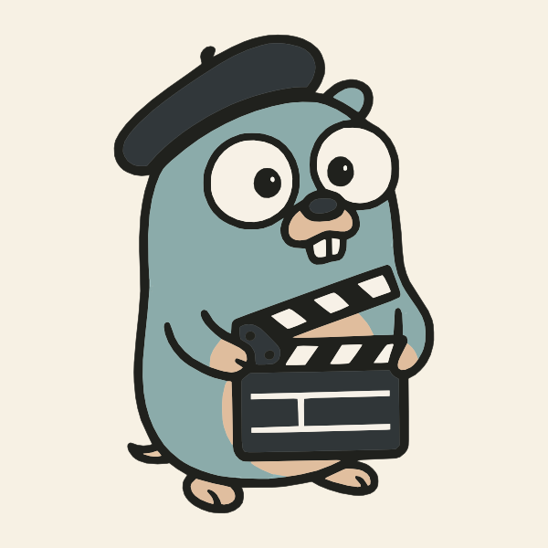

<p align="center">
  
</p>

# Francis: the simple & low-maintenance Go distributed actor framework

📚 **[Read the documentation](https://francis.italypaleale.me)**

Francis is a framework and runtime for **Distributed Actors** (also known as _durable objects_) for Go apps.

With Francis, you can build **highly-available** apps that **scale horizontally** and/or use **microservices**. Unlike other actor frameworks, Francis is designed to be simpler to add to your solution and lower-maintenance: it only requires a relational database (PostgreSQL or SQLite) and can optionally run embedded in your apps too, without a separate control plane service.

**What you can use Francis for:**

- Build [**stateful services**](https://francis.italypaleale.me/docs/concepts/) where each entity (a user, a device, a shopping cart, a game session…) is an actor with its own durable state
- Run [**background work on a schedule**](https://francis.italypaleale.me/docs/alarms/) with durable alarms that survive restarts
- Process a [**distributed pool of long-running tasks**](https://francis.italypaleale.me/docs/builtin-actors/) with a bounded number per host that scales out as you add hosts
- Add resilience to **microservices** without standing up extra infrastructure beyond a database

```go
// An actor is just a Go struct that implements one or more methods
func (c *Counter) Invoke(ctx context.Context, method string, data actor.Envelope) (any, error) {
	state, _ := c.client.GetState(ctx)
	state.Count++
	_ = c.client.SetState(ctx, state, nil)
	return state.Count, nil
}
```

Francis is fully open source and released under a permissive MIT license.

> If you're new to the distributed actors pattern, [this article](https://withblue.ink/2025/11/distributed-actors-model) provides a good starting point.

## Key features

- **Virtual actors**: actors are addressed by type and ID, activated on demand, and run one invocation at a time (_turn-based concurrency_), so you never manage their lifecycle or worry about concurrent access to their state
- **Durable state**: each actor has its own state, persisted in PostgreSQL or SQLite, which survives deactivation, restarts, and moving between hosts
- **Durable alarms**: schedule one-off or repeating work that survives process restarts
- **Two topologies, same code**: run everything embedded in your app (_local_) with no extra services, or point your workers at a standalone runtime (_remote_) when you want a dedicated control plane
- **Low-maintenance**: the only hard dependency is a relational database, no separate message broker or external coordination service
- **Secure by default**: hosts authenticate each other with mTLS using certificates derived from a shared cluster key, with pluggable host bootstrap (pre-shared key or JWT)
- **Built for Go**: a small, idiomatic API built around the standard library, `context.Context`, and generics

## Quick start

Add Francis to your Go module:

```sh
go get github.com/italypaleale/francis
```

Create an actor host with an embedded SQLite store (the _local_ topology, which requires no additional services), register your actor, and run it:

```go
h, err := local.NewHost(
	local.WithAddress("127.0.0.1:7571"),
	local.WithSQLiteProvider(local.SQLiteProviderOptions{
		ConnectionString: "data.db",
	}),
	// The runtime PSK derives the cluster CA used for host-to-host mTLS
	local.WithRuntimePSKs([]byte("change-me-please")),
)
if err != nil {
	log.Fatal(err)
}

// Register actor types before running the host
err = h.RegisterActor("counter", NewCounter)
if err != nil {
	log.Fatal(err)
}

// h.Service() lets you invoke actors and manage their state and alarms
err = h.Run(context.Background())
```

See the [Quickstart](https://francis.italypaleale.me/docs/quickstart/) for the complete, runnable walkthrough.

## Documentation

All documentation lives on the [website](https://francis.italypaleale.me).

Quick links:

- [What is Francis](https://francis.italypaleale.me/docs/what-is-francis/) — the actor model, how it works, and what Francis gives you
- [Core concepts](https://francis.italypaleale.me/docs/concepts/) — actors, state, alarms, placement, and the activation lifecycle
- [Quickstart](https://francis.italypaleale.me/docs/quickstart/) — build and run your first actor
- [Writing actors](https://francis.italypaleale.me/docs/writing-actors/) — the full actor API
- [Topologies](https://francis.italypaleale.me/docs/topologies/) — local vs. remote, and choosing the right one
- [Deploying the runtime](https://francis.italypaleale.me/docs/deploying-the-runtime/) — running the standalone control plane

You can also find runnable samples in the [`examples`](./examples) directory.

## License

Francis is open source software released under a permissive MIT license. See [LICENSE](./LICENSE).

> _What's in the name? As an actor framework, Francis is named after the world-famous movie director Francis Ford Coppola_
