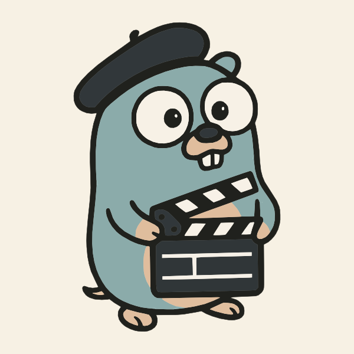

# The simple & low-maintenance Go distributed actor framework

Francis is a framework and runtime for **Distributed Actors** (also known as **Durable Objects**) for Go apps.

With Francis, you can build **highly-available** apps, that **scale horizontally** and/or use **microservices**. Unlike other actor frameworks, Francis is designed to be simpler to add to your solution and with low maintenance: it only requires a relational database (Postgres or SQLite) and can optionally run embedded in your apps too (without a separate control plane service).

> ## ⚠️🚧 Work in progress 🚧⚠️
>
> While currently functional, this project is still under **heavy development**. APIs are not final and are expected to change until the first official release.

> _What's in the name? As an actor framework, Francis is named after the world-famous movie director Francis Ford Coppola_
