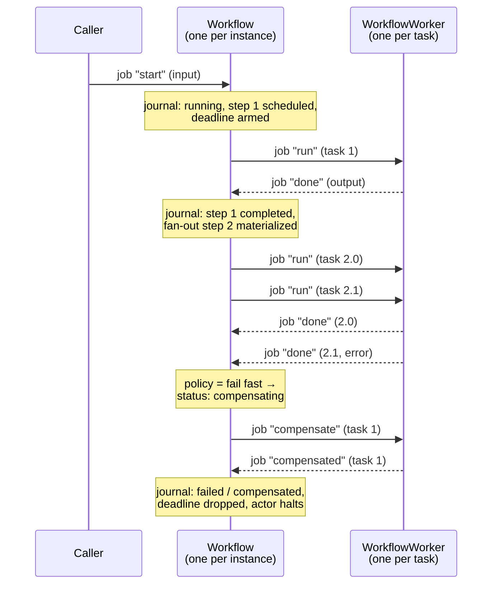
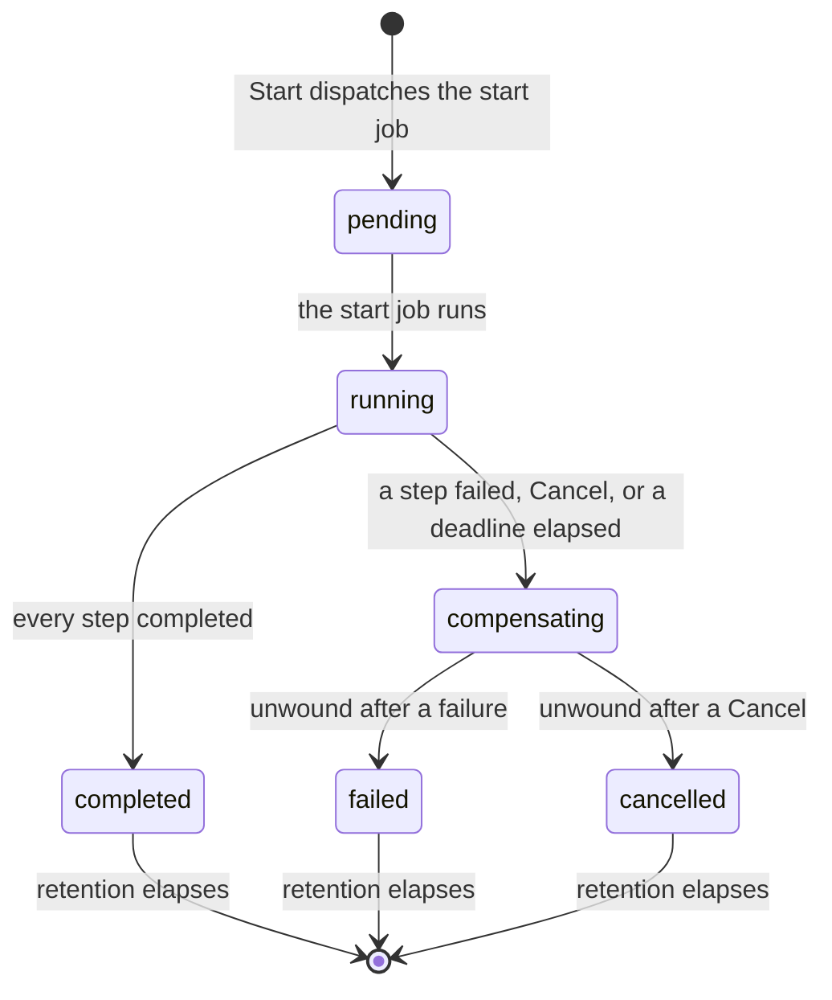

# Design: generic workflows as a built-in actor

- **Status**: draft, for discussion
- **Package**: `builtin/workflow` (new)
- **Reserved actor types**: `francis.builtin.workflow.<name>`, `francis.builtin.workflow.<name>.worker`
- **Prior art in the wild**: Pixel's `imageoptim` service, which hand-rolls this pattern on top of Francis actors, jobs, and alarms. Its [`pkg/actors/README.md`](https://github.com/ItalyPaleAle/pixel/blob/devel/v1/services/imageoptim/pkg/actors/README.md) documents the shape this design generalizes.

## 1. Summary

Francis already has every primitive a durable workflow engine needs: single-activation actors with turn-based concurrency, durable per-actor state, durable jobs with retries and dead-lettering, named replaceable alarms, and placement that spreads actors across a cluster. What it does not have is the *pattern* that assembles them, so every application that wants "run these steps, in this order, some of them in parallel, and undo them if something fails" writes the same orchestrator by hand.

This document generalizes the pattern that `imageoptim` proved out into a **built-in actor** that runs arbitrary workflows: sequences of steps, parallel groups, dynamic fan-out, and **compensations** that roll back what already succeeded.

Two commitments shape everything below.

The first is that there is **no SDK abstracting the underlying actors** the way Dapr Workflow does. No code-as-workflow, no replay, no determinism requirement, no hidden control flow. A workflow is a **declared graph of named steps** plus plain Go handler functions, and the engine is a state machine over a durable journal.

The second is the **orchestration boundary** (§4): the `Workflow` actor orchestrates and performs nothing. Every unit of work, without exception, runs on a `WorkflowWorker`. This is the single most important rule in the design, and making it structural — rather than a convention each application has to keep — is most of the value of shipping this as a built-in.

## 2. Motivation

### 2.1 What `imageoptim` does today

`imageoptim` turns one uploaded image into N thumbnails, writes a manifest describing the outcome, and posts that manifest back to Pixel. Its actors implement a workflow by hand, split into an orchestrator and a worker:

```text
POST /v1/thumbnail
      │  job "start"
      ▼
ImageWorkflow/<imageID>                         ← orchestrator: state and dispatch, nothing else
      │  job "generate", one per thumbnail
      ├──────────► worker/<id>-0  ┐
      ├──────────► worker/<id>-1  │  read source, encode with libvips, write to the store
      └──────────► worker/<id>-2  ┘
      ◄─────────── job "thumbnail-done" ────────┘
      │  job "write-manifest"
      ├──────────► worker/<id>-manifest ──► store manifest.json
      ◄─────────── job "manifest-done" ─────────┘
      │  job "deliver-webhook"
      ├──────────► worker/<id>-webhook  ──► POST the manifest to Pixel
      ◄─────────── job "webhook-done" ──────────┘
      │
      ▼
  record the outcome → drop the deadline → halt
```

The properties that make it work are all general, and none of them are about images:

1. **The orchestrator performs no step.** It reads and writes its own state, arms its alarm, and dispatches jobs. Every read and write of the object store, every libvips encode, and the callback happen on a worker. The manifest write and the webhook were originally done inline on the orchestrator's terminal turn, and moving them out is the change this design takes as its starting point.
2. **Executable steps are durable jobs; the deadline is an alarm.** A job is dispatched per unit of work, is retried, and is dead-lettered rather than dropped. The deadline is an alarm because it must be replaceable and cancellable by name, and it is re-armed on entry to each step so it covers whichever one is in flight.
3. **There is no phase field.** What the workflow does next is derived from its state — remaining thumbnails, then the manifest, then the webhook — which is what keeps every report safe to redeliver.
4. **Every step is idempotent**, because jobs and alarms are delivered at least once: a repeated `start` re-schedules only what has not reported, a repeated result is recorded once, a re-run thumbnail overwrites the same object, and a re-written manifest writes identical bytes.
5. **A duplicate report still drives the next step**, even though it records nothing. A turn that persisted its result and then failed to dispatch is retried from the duplicate branch, and without this the workflow would sit waiting for a step nobody scheduled.
6. **One actor per unit of work** is what buys parallelism: Francis places workers across hosts and bounds them with `WithConcurrencyLimit`.
7. **Failure has two paths**: a retryable error returns and is retried by the job engine; a permanent one reports a failed result immediately, and the dead-letter hook (`ActorJobFailed`) covers the case where retries are exhausted. The deadline remains the backstop, because that hook is best-effort.
8. **What a step's failure costs the workflow varies by step.** A failed thumbnail is recorded and the workflow still terminates; an unstored manifest fails the workflow and skips the callback; an unacknowledged callback is logged and the workflow still completes.

### 2.2 Why generalize it

Everything above is boilerplate that any durable multi-step process needs, and it is subtle boilerplate: the ordering of "persist, then dispatch", the redrive on a duplicate report, the idempotency keys, the dead-letter hook, the alarm re-armed per step. Getting one of them wrong produces a workflow that stalls forever or double-charges a credit card.

Two things `imageoptim` does **not** need, and which a general engine must have:

- **Declared sequencing.** `imageoptim`'s order is hard-coded in a `switch` over its own state. That is exactly right for three steps and stops scaling somewhere around five.
- **Compensation.** `imageoptim` writes to an object store, where a partial result is harmless and a manifest records what failed. A workflow that charges a card, reserves stock, and books a courier must be able to unwind.

## 3. Goals and non-goals

### Goals

- Sequential steps, static parallel groups, and dynamic fan-out over a runtime-sized list.
- Per-step **compensation callbacks**, run in reverse order when the workflow fails or is cancelled.
- Durable and resumable across restarts, host loss, and rebalancing, with at-least-once execution.
- Steps run **anywhere in the cluster**, with per-host concurrency bounds and optional capability requirements.
- **A `Workflow` actor that cannot perform work**, because the engine gives user code nowhere to run on it (§4).
- Observable: status query, listing, metrics, traces, and a journal an operator can read.
- Registered and driven exactly like the other built-in actors (`taskpool`, `cronjob`, `signal`, `ratelimit`).

### Non-goals

- **No code-as-workflow SDK.** There is no `ctx.CallActivity(...).Await()`, no replay of a Go function, and therefore no determinism constraints on user code. This is the explicit design choice that separates this from Dapr Workflow and Durable Task.
- **No arbitrary control flow.** No `goto`, no unbounded loops, no dynamic graph rewriting. Conditional skipping is supported; anything more expressive belongs in a child workflow or a fresh instance.
- **Not a queue and not a saga coordinator across clusters.** A workflow instance is an actor: it lives in one cluster and one database.
- **No exactly-once.** At-least-once with idempotent handlers, like everything else in Francis.

## 4. The orchestration boundary

> **The `Workflow` actor orchestrates. It never performs a step.**
>
> It reads and writes its own state, arms and drops one alarm, and dispatches jobs. Anything that can fail, or that takes longer than an instant, belongs on a `WorkflowWorker`.

This is stated first because it is the rule every other decision in this document defers to, and because it is the rule that is easiest to erode one small exception at a time. "It's only one `PUT`." "The callback usually answers in 50ms." Each is individually defensible and collectively fatal.

### 4.1 Why it matters

A `Workflow` actor holds its turn lock for the duration of a turn. While a turn runs, that instance cannot:

- accept a result from any other worker, so a wide fan-out serializes behind the slow turn;
- accept a cancellation, so `Cancel` does not take effect until the blocking call returns;
- handle its own deadline alarm, so the mechanism that guarantees termination is itself blocked by the thing it exists to bound;
- serve a status `Peek`, because `Peek` excludes an in-flight write turn.

A single blocking call on the orchestrator therefore degrades every property the engine is supposed to provide, and it does so exactly when things are going worst — a store that has become slow, a callback endpoint that has started hanging.

It also breaks the failure model. A step that runs on a worker gets its own retries, its own backoff, its own dead-letter record, and its own deadline, and a failure is *data* the journal records. The same work inlined on the orchestrator gets the orchestrator's retry policy, and its failure re-runs the whole turn — including the parts that already succeeded.

Francis' other built-ins reach the same conclusion from the same starting point: `cronjob` splits a scheduler from a runner precisely so that a long-running job never blocks the scheduler's lifecycle invocations.

### 4.2 What the rule permits

| On the `Workflow` actor | On a `WorkflowWorker` |
|---|---|
| Decode a report from a job payload | Any call to a database, object store, HTTP API, or queue |
| Mutate the in-memory journal | Any user handler (`WithRun`, `WithCompensate`) |
| `advance`: decide what comes next, as a pure function of the journal | Any CPU-bound work: encoding, rendering, compression |
| Build a job payload from the journal, in memory | Anything with a timeout of its own |
| `GetState` / `SetState` / `DeleteState` | Anything whose failure should be retried independently |
| `SetAlarm` / `DeleteAlarm` | Anything that should appear as its own dead-letter record |
| `Dispatch` / `CancelJob` | |
| `Halt`, log, emit a metric | |

The operations in the left column are not free — `SetState` and `Dispatch` are database writes and can fail. The distinction is that they are the framework's own bounded, fast, retried operations, and the whole turn is retried as a unit if one of them fails. The rule is about **external and user work**, which is neither bounded nor the framework's to retry.

Two consequences are worth stating explicitly, because they are the cases that look like exceptions:

- **Deriving a payload is orchestration; writing it is a step.** `imageoptim` builds its manifest on the orchestrator, from persisted state, and hands the finished bytes to a worker to store. That is correct on both counts: building is a pure in-memory function of the journal, and doing it there is what makes a retried write store *identical* bytes rather than re-deriving them against a journal that has since moved on.
- **The orchestrator never calls `Invoke`.** A synchronous invocation couples this instance's turn lock to another actor's availability and queue depth. Talking to another actor is a step, dispatched as a job, and it reports back like any other.

### 4.3 How the engine enforces it

A hand-rolled workflow keeps this rule by discipline. A built-in keeps it by construction, and that is most of the argument for building one:

1. **The definition exposes no hook that runs on the `Workflow` actor.** `WithRun` and `WithCompensate` are the only places user code appears, and both are invoked exclusively by `WorkflowWorker`. There is no `WithBeforeStep`, no orchestrator-side predicate, no expander callback. If a future option seems to want one, that is a signal the feature is a step.
2. **`advance` is a pure function** of `(journal, definition)`. It performs no I/O, takes no `context.Context`, and returns the next journal. It is unit-testable from a serialized journal alone, and it cannot block.
3. **Fan-out sizes come from a step's output** (§9.2), not from a callback the orchestrator runs. This costs one durable round-trip and is the single largest concession the rule extracts — and it is worth it.
4. **Conditions are step outputs** (§17), not predicates evaluated on the orchestrator, for the same reason.
5. **Payload and journal size caps** (§11.2) are checked on the worker, before a report is dispatched, so the orchestrator never spends a turn serializing something unbounded.

The engine can also assert the boundary in tests: a `Workflow` actor constructed against a `Service` whose transport panics on anything but state, alarm, and job operations will fail any turn that reaches past the boundary.

## 5. Relationship to Dapr Workflow

Dapr Workflow (and the Durable Task Framework it is built on) expresses a workflow as a Go/C#/Java function that calls activities, and makes it durable by **replaying** that function from an event history on every resumption. The function must therefore be deterministic: no clocks, no random numbers, no I/O, no map iteration order.

That is a powerful model, and it is also the source of nearly all of its sharp edges: the determinism rules, the versioning problem when the code changes under a running instance, the difficulty of reasoning about what the runtime is doing, and the size of the SDK required to hide it.

This design keeps the parts of Dapr's model that are unambiguously good and drops the replay:

| | Dapr Workflow | This design |
|---|---|---|
| Workflow shape | imperative function, replayed | declared graph of named steps |
| Determinism required | yes, strictly | no |
| History used for | replaying the orchestrator function | driving a state machine, and audit |
| Activity dispatch | queue + work items | Francis durable job per task |
| Orchestration state | event-sourced history | one journal document per instance |
| Compensation | hand-written `defer`/`try` inside the orchestrator | declared per step, engine-driven |
| Dynamic fan-out | `for` loop over `CallActivity` | `ForEach` step over a list from an upstream step |
| Conditionals, loops | arbitrary Go | conditions only; loops out of scope |

Notably, Dapr's orchestrator is also forbidden from doing real work — that is what the determinism rules amount to — but it enforces this with a contract the developer must learn and can violate at runtime. Here the same guarantee comes from there being no place to put the violation.

The cost of dropping replay is expressiveness: a graph cannot say "retry the whole subworkflow with a different parameter until it works". The benefit is that the engine is a few hundred lines of state machine with no hidden rules, the journal is directly readable, and a user's handler is just a function that can do whatever it likes — including calling `time.Now()`.

## 6. Model

### 6.1 Vocabulary

- **Definition** — a named, versioned graph of steps, registered on a host at startup, together with the Go functions that implement them. Registered identically on every host that should run the workflow's steps.
- **Instance** — one execution of a definition, identified by an **instance ID**. One `Workflow` actor instance per workflow instance.
- **Step** — a named node in the definition. A step is one of the kinds below.
- **Task** — one execution unit of a step, performed by one `WorkflowWorker` actor and driven by one durable job. A plain step has one task; a parallel group has one per member; a fan-out has one per item.
- **Journal** — the `Workflow` actor's durable state: the instance's status, its input, and one record per step and task. It is the single source of truth.
- **Compensation** — a per-step callback that undoes the effect of a task that completed successfully.

### 6.2 Step kinds

| Kind | Constructor | Tasks | Notes |
|---|---|---|---|
| Plain | `workflow.Step(name, opts...)` | 1 | The common case |
| Parallel group | `workflow.Parallel(name, steps...)` | one per member | Members are plain steps; they run concurrently |
| Fan-out | `workflow.ForEach(name, opts...)` | one per item, sized at runtime | Items come from an upstream step's output |
| Wait for event | `workflow.WaitForEvent(name, opts...)` | 0 | Parks the instance until `RaiseEvent` or a deadline |

Steps are addressed **by name**, never by position, which is what makes the journal survive a definition change (§14).

### 6.3 Data flow between steps

Each task receives, in its job payload:

- the **workflow input**, as given to `Start`;
- the **output of the immediately preceding step**;
- the outputs of any steps named with `WithInputFrom("a", "b")`;
- for a fan-out task, its **item**.

The engine never ships the whole journal to a worker. This keeps the payload bounded and makes the data dependencies of a step explicit and auditable from the definition alone.

A task returns `(any, error)`. The output is JSON-encoded into the journal, subject to `WithMaxOutputSize` (default 64 KiB per task, mirroring `signal`'s payload cap). A fan-out step's output, seen by later steps, is the array of its tasks' outputs, ordered by item index.

Outputs are for **control flow and small results**, not for payloads. The guidance is the same as for actor state: keep large blobs in an object store and put a reference in the output.

## 7. Public API

### 7.1 Defining and registering

```go
import "github.com/italypaleale/francis/builtin/workflow"

wf, err := workflow.New("order-fulfillment",
    workflow.WithVersion(3),
    workflow.WithTimeout(30*time.Minute),
    workflow.WithRetention(24*time.Hour),
    workflow.WithConcurrency(4),
    workflow.WithLogger(log),

    workflow.WithSteps(
        // A plain step, with the compensation that undoes it
        workflow.Step("charge-card",
            workflow.WithRun(chargeCard),
            workflow.WithCompensate(refundCard),
            workflow.WithMaxAttempts(5),
            workflow.WithStepTimeout(30*time.Second),
        ),

        workflow.Step("reserve-stock",
            workflow.WithRun(reserveStock),
            workflow.WithCompensate(releaseStock),
        ),

        // A human (or another system) has to approve before the order ships
        workflow.WaitForEvent("approval",
            workflow.WithEventTimeout(48*time.Hour),
        ),

        // Two independent notifications, run at the same time
        workflow.Parallel("notify",
            workflow.Step("email", workflow.WithRun(sendEmail)),
            workflow.Step("sms", workflow.WithRun(sendSMS)),
        ),

        // One task per element of the "plan-shipments" output, run concurrently
        workflow.ForEach("ship",
            workflow.WithItemsFrom("plan-shipments"),
            workflow.WithRun(bookCourier),
            workflow.WithCompensate(cancelCourier),
            workflow.WithMaxParallel(8),
            workflow.WithFailurePolicy(workflow.CollectFailures),
            workflow.WithRequiredCapability("eu-region"),
        ),

        // Best-effort: a failure here is recorded and the workflow still completes
        workflow.Step("notify-analytics",
            workflow.WithRun(postToAnalytics),
            workflow.WithOptional(),
        ),
    ),
)
if err != nil {
    return err
}

// Register before the host starts, on every host that should run this workflow's steps
err = host.RegisterBuiltInActor(wf)
```

`New` follows the conventions of the other built-ins exactly: a unique name validated with `ref.ValidateComponents`, functional options, a single returned value registered with `RegisterBuiltInActor`, and a `Service` method that binds it to an `actor.Service`.

### 7.2 Handler contract

```go
// RunFunc performs one task of a step and returns the output recorded in the journal
// It runs on a WorkflowWorker, never on the Workflow actor
// Returning an error retries the task; returning actor.ErrJobPermanentFailure fails it immediately; returning actor.ErrJobRejected declines it so another host runs it
type RunFunc func(ctx context.Context, t Task) (output any, err error)

// CompensateFunc undoes the effect of one task that had completed successfully
// It also runs on a WorkflowWorker
type CompensateFunc func(ctx context.Context, c Compensation) error

type Task interface {
    // Identity of the task, which is also what every log line and span is tagged with
    InstanceID() string
    Workflow() string
    Step() string
    // Index is the position within a parallel group or fan-out, and -1 for a plain step
    Index() int
    // Attempt is 1 on the first execution and increases with each retry
    Attempt() int

    // DecodeInput reads the workflow input, as given to Start
    DecodeInput(into any) error
    // DecodeItem reads this task's fan-out item, and is a no-op for a step that is not a fan-out
    DecodeItem(into any) error
    // DecodeOutput reads the output of an upstream step, which must be the preceding step or one named with WithInputFrom
    DecodeOutput(step string, into any) error
}

type Compensation interface {
    Task
    // DecodeResult reads the output this task produced when it succeeded, which is usually what identifies the effect to undo
    DecodeResult(into any) error
    // Cause is the error that caused the workflow to unwind, or the cancellation reason
    Cause() string
}
```

A handler is a plain function. It may call the clock, do I/O, use randomness, and start goroutines — precisely because it never runs on the `Workflow` actor. The only contract is **idempotency**, because at-least-once delivery means it can run twice.

### 7.3 Driving workflows

```go
svc := wf.Service(host.Service())

// Start an instance
// Without WithInstanceID, the engine mints a UUIDv7, which sorts by creation time
id, err := svc.Start(ctx, OrderInput{OrderID: "A-91", Total: 4999})

// Use a natural key to make starting idempotent: a second Start with the same ID is a no-op
id, err = svc.Start(ctx, input, workflow.WithInstanceID("order-A-91"))

// Read the current status without taking the Workflow actor's exclusive turn
status, err := svc.GetStatus(ctx, id)

// List instances, paginated, built on Service.ListStates
page, err := svc.List(ctx, &workflow.ListOptions{Status: workflow.StatusRunning, Limit: 50})

// Deliver an external event to a WaitForEvent step
err = svc.RaiseEvent(ctx, id, "approval", ApprovalPayload{By: "ops"})

// Ask a running instance to stop and unwind
err = svc.Cancel(ctx, id, "customer cancelled the order")

// Drop the journal of a terminated instance before its retention elapses
err = svc.Purge(ctx, id)
```

`Start` returns as soon as the start job is durable, which is the same guarantee `imageoptim`'s handler gives its callers: from that point on the work survives a restart of the process.

## 8. Execution model

### 8.1 The two actors

Two reserved actor types per registered workflow:

| Actor | Actor type | Instances | Responsibility |
|---|---|---|---|
| `Workflow` | `francis.builtin.workflow.<name>` | one per instance, actor ID is the instance ID | **Orchestrator.** Owns the journal. Decides what happens next, records what came back, and terminates. State, alarm, and dispatch — nothing else (§4). |
| `WorkflowWorker` | `francis.builtin.workflow.<name>.worker` | one per task | **Worker.** Performs exactly one task and reports the outcome back. Every user handler and every external call happens here. |

A `WorkflowWorker` is stateless: the task arrives in its job payload and the result leaves in another job, so it halts itself as soon as it has reported rather than lingering to its idle timeout. This matters for a wide fan-out, which would otherwise hold one activation per task.

Splitting them is what buys parallelism — Francis places workers independently across the cluster — and it is what keeps the orchestration boundary structural rather than aspirational.

### 8.2 The `Workflow` turn

Every turn — whether triggered by the start job, a task result, an event, a cancellation, or the deadline alarm — runs the same four phases:

```go
func (w *Workflow) turn(ctx context.Context, ev event) error {
    // The journal is the source of truth, and a terminated instance ignores everything
    st, err := w.client.GetState(ctx)
    if err != nil {
        return err
    }
    if st.Status.IsTerminal() {
        return nil
    }

    // Fold the event into the journal
    // A duplicate, or a result for a task the journal does not know about, records nothing here
    apply(&st, ev)

    // Advance the cursor as far as the journal allows, which is a pure function of the journal and the definition
    // This is where a completed step opens the next one, a failed step opens the unwind, and a fully unwound instance terminates
    advance(&st, w.def)

    // The journal is durable before anything is scheduled, so a lost dispatch is always recoverable and an orphan result never is
    err = w.client.SetState(ctx, st, w.stateOpts(st))
    if err != nil {
        return err
    }

    // Everything the journal says should be running is dispatched, idempotently
    // This runs on every turn, including the ones that recorded nothing
    return w.reconcile(ctx, st)
}
```

`advance` is pure and total: given the journal and the definition, it produces the next journal. It never performs I/O and never runs user code, so it is trivially unit-testable, and a bug in it can be reproduced from a serialized journal alone.

`reconcile` derives the set of tasks that should be in flight from the journal and dispatches each one with a stable idempotency key. It is the *only* thing that schedules work, and it is safe to run at any time.

**Recovery is not a special code path.** Re-delivering any event, or firing the watchdog, re-runs `advance` + `reconcile` and converges on the same journal.

### 8.3 The three ordering invariants

Everything durable in this design rests on three rules.

**1. Persist before dispatching.** The journal records a task as *scheduled* before the job that runs it exists. If the process dies between the two, the triggering job is retried (jobs complete only after the handler returns), the turn re-runs, and `reconcile` dispatches it. The inverse order would allow a task to report back to a journal that does not know it exists, and that result would be dropped.

**2. A turn that records nothing still schedules.** `advance` and `reconcile` run on every turn, including one whose event was a duplicate. This is not an optimization to skip — it is load-bearing. Consider a turn that persists a result and then fails to dispatch the next step: the job is retried, the report arrives again, and it is now a *duplicate* that records nothing. If the duplicate branch returned early, the instance would wait forever for a step nobody scheduled. `imageoptim` hit exactly this and fixed it by re-driving from the duplicate branch; here it falls out of the structure, because there is no early return to add.

**3. The journal decides what happened; the idempotency key only prevents duplicate in-flight work.** Francis maps an idempotency key to the job's name and deduplicates against *live* rows, so a key is reusable once its job completes. That is exactly right here: the key stops `reconcile` from queueing a second copy of a task that is already pending or running, and the journal's `Done` flag stops a duplicate *result* from being counted twice.

### 8.4 Message flow



### 8.5 Job methods

| Method | Target | Dispatched by | Idempotency key |
|---|---|---|---|
| `start` | `Workflow` | `Service.Start` | `start` |
| `done` | `Workflow` | `WorkflowWorker` | `done\|<step>\|<index>` |
| `compensated` | `Workflow` | `WorkflowWorker` | `comp\|<step>\|<index>` |
| `event` | `Workflow` | `Service.RaiseEvent` | `event\|<name>` |
| `cancel` | `Workflow` | `Service.Cancel` | `cancel` |
| `run` | `WorkflowWorker` | `Workflow` | `run` |
| `compensate` | `WorkflowWorker` | `Workflow` | `compensate` |

The worker's keys are constant because each task has its own actor, so the key only has to be unique within it. `imageoptim` uses one report method per step (`thumbnail-done`, `manifest-done`, `webhook-done`); generalizing collapses them into `done` keyed by step and index.

### 8.6 Worker actor IDs

A worker's ID must be **deterministic**, so that a re-run of `reconcile` addresses the same actor and its idempotency key applies:

```text
<instanceID>|<step>|<index>
```

`|` is the delimiter, so step names are rejected at definition time if they contain it, and instance IDs are rejected at `Start` if they do. (Francis itself only reserves `/`.) `imageoptim` reaches the same place with `<workflowID>-<index>` plus named suffixes like `-manifest`, and has to argue that a numeric suffix cannot collide with a named one; keying on the step name removes the argument.

A hash of the three components would avoid constraining names at the cost of unreadable actor IDs in logs and traces; readability wins, since these IDs are what an operator greps for.

### 8.7 Alarms: exactly one per instance

The `Workflow` actor keeps **one** alarm, named `deadline`, recomputed on every turn to the earliest of:

- the instance timeout from `WithTimeout`,
- the current step's timeout from `WithStepTimeout`,
- a `WaitForEvent` step's `WithEventTimeout`,
- the next watchdog tick, if `WithWatchdog` is set.

Alarms are named and replaceable, so recomputing is a single `SetAlarm`, and the alarm is deleted when the instance terminates. This generalizes `imageoptim`'s rule that the deadline is re-armed on entry to each step so it covers whichever one is in flight, and keeps the alarm table proportional to the number of *running instances* rather than running steps.

When it fires, the `Workflow` actor determines from the journal which deadline actually elapsed and applies it: fail the outstanding tasks of a timed-out step, fail the instance on an instance timeout, or simply re-run `advance` + `reconcile` for a watchdog tick. What a timeout *costs* depends on the step it hit, which the per-step policies in §8.9 decide — the same conclusion `imageoptim` reached, where a timeout on the thumbnails carries on to the manifest but a timeout on the manifest fails the workflow.

`WithWatchdog(d)` is **off by default**. The dispatch path is already recoverable through job retries, and a repeating alarm per running instance is a real cost at scale (10,000 running instances on a one-minute watchdog is ~167 alarm executions per second). Enabling it is the right call for long-running workflows where a stall would otherwise go unnoticed until the instance timeout.

### 8.8 Failure of a task

A task has three ways to end, mirroring what `imageoptim`'s worker does:

1. **Success** — it dispatches `done` with its output and halts.
2. **Retryable failure** — it returns the error, the job engine retries it with backoff up to `WithMaxAttempts`.
3. **Permanent failure** — it returns `actor.ErrJobPermanentFailure` (or exhausts its retries) and the job is dead-lettered. The worker's `JobFailed` hook then dispatches `done` carrying the error, so the `Workflow` actor learns immediately instead of waiting for a deadline.

The distinction between (2) and (3) belongs to the handler and is worth stating in the docs: a store that is briefly unavailable recovers, so it should return the error and be retried; a request the encoder rejects, or an identifier that does not parse, fails the same way every time and should report immediately rather than burning the job's retries.

The `JobFailed` hook is best-effort, so the `deadline` alarm remains the backstop, exactly as it is in `imageoptim`.

A handler can also return `actor.ErrJobRejected` to decline a task on this host without counting an attempt, which re-routes it. This is the same escape hatch `taskpool` exposes through `WithAccept`, and it is how a host says "not me" for reasons a static capability cannot express.

### 8.9 What a step's failure costs the workflow

Not every step is equally important, and `imageoptim` demonstrates all three cases in one workflow: a failed thumbnail is recorded and the run continues, an unstored manifest fails the run and skips the callback, and an unacknowledged callback is logged while the run still completes. A plain step therefore declares what its own failure means:

| Option | On failure |
|---|---|
| default | The step fails, and the workflow unwinds |
| `WithOptional()` | The failure is recorded in the journal and the workflow carries on to the next step |
| `WithSkipOnFailure("a", "b")` | The step fails the workflow, and the named downstream steps are recorded as `skipped` rather than run |

`WithOptional` is the webhook case: the work the caller asked for was done, and only a notification was lost. It is deliberately a per-step declaration rather than a global policy, because it is a statement about that step's meaning.

Group and fan-out steps have a richer set of policies, in §9.3.

## 9. Parallelism

### 9.1 Static parallel groups

`workflow.Parallel(name, steps...)` materializes one task per member. The group completes when every member has reported. Members are independent: they receive the same upstream outputs and cannot read each other's.

### 9.2 Dynamic fan-out

`workflow.ForEach(name, workflow.WithItemsFrom("plan"), ...)` materializes one task per element of the named step's output, which must decode to a JSON array. The size is decided at runtime, when the upstream step reports, and is then **journaled**: a retried turn re-reads the recorded items rather than re-deriving them.

Deriving the list is a normal step that runs on a worker. That is a direct consequence of §4: an expander callback invoked on the `Workflow` actor's turn would be simpler to write, but it would put an arbitrary user function on the instance's control plane — the exact thing the boundary exists to prevent. The cost is one extra durable round-trip, and the benefit is that the expansion is itself retried, dead-lettered, traced, bounded by a deadline, and recorded like any other step.

`WithMaxParallel(n)` bounds how many of a fan-out's tasks are in flight **per instance**: `reconcile` dispatches at most `n` at a time and releases the next as results arrive. It is orthogonal to the per-host bound in §9.4, which limits how much work a host accepts across all instances.

### 9.3 Failure policies for groups and fan-outs

| Policy | Behavior |
|---|---|
| `workflow.FailFast` (default) | The first failure fails the step. Pending tasks of the group are cancelled with `CancelJob`; tasks already running are allowed to finish and their results are recorded (and compensated, if they succeeded). |
| `workflow.CollectFailures` | Every task runs to completion, then the step fails if any of them failed. Use when the tasks are independent and partial progress is worth having before unwinding. |
| `workflow.TolerateFailures` | Every task runs to completion and the step succeeds regardless. Failures are visible in the step's output, and it is the next step's business what to do about them. |

`TolerateFailures` is exactly `imageoptim`'s thumbnail semantics: a thumbnail that cannot be encoded is recorded as failed in the manifest and does not stop the run, and the manifest step downstream reads the outcomes and reports them.

Note that `CancelJob` removes a pending job but does not interrupt an occurrence that is already executing; a task that wants to stop early must observe its context.

### 9.4 Placement, capacity, and capabilities

Worker actor types are registered with the same mechanics `taskpool` uses:

- `WithConcurrency(n)` puts every worker type of the workflow into one **capacity group** with a strict, in-process per-host budget, and mirrors it as the cluster-wide `ConcurrencyLimit` placement hint so hosts are rarely handed more than they can run.
- `WithRequiredCapability(cap)` on a step routes its tasks to a per-capability worker type (`francis.builtin.workflow.<name>.worker.<cap>`) that only hosts advertising the capability register. A step with no requirement runs anywhere.

This makes "the OCR step only runs on hosts with a GPU" a one-line property of the definition, and it means throughput scales by adding hosts with no change to the definition.

One caveat is worth carrying over from `imageoptim`, which notes it explicitly: because every step of a workflow shares one worker type, it shares one per-host budget, and a slow step occupies a slot an expensive one could have used — a callback waiting on a remote server holds a slot sized for an image encode. Capability queues are the existing escape hatch (route the cheap steps to their own capability), but a `WithCapacityGroup(name)` per step would express it directly. Left open in §17.

## 10. Compensation

### 10.1 Model

Compensation is a **stack**. Every task that completes successfully and whose step declares `WithCompensate` is pushed onto the journal's compensation stack in completion order. When the instance has to unwind, the stack is popped in reverse.

```text
forward:      charge-card ──► reserve-stock ──► ship[0] ship[1] ship[2] ──► ✗ confirm
                                                (parallel)

unwind:       refund-card ◄── release-stock ◄── cancel-courier ×3
                                                (parallel, in one frame)
```

Ordering rules:

- **Frames unwind in reverse order.** A step that ran after another is compensated before it, which is the invariant a saga depends on.
- **Within a frame, compensations run concurrently.** The tasks of a parallel group or fan-out had no order between them going forward, so imposing one on the way back would only make unwinding slower.
- **A frame is fully compensated before the next one starts.** This is what makes the reverse order meaningful, and it is why compensation is driven by the same `advance` + `reconcile` loop rather than by dispatching everything at once.

Every compensation is a task on a `WorkflowWorker`, like every other unit of work. The unwind is scheduled by the `Workflow` actor and performed nowhere near it.

### 10.2 What triggers an unwind

- A step fails terminally, under a policy that makes that a step failure (§8.9, §9.3).
- `Service.Cancel` is called on a running instance.
- The instance timeout elapses.
- A `WaitForEvent` step's own timeout elapses without the event.

In every case the journal records the **cause**, which is handed to each compensation as `Cause()`. A compensation frequently needs it: "release the stock because the payment failed" and "release the stock because the customer cancelled" may write different audit records.

### 10.3 Executing a compensation

A compensation is a durable job (`compensate`) to the **same worker actor ID** the forward task used, carrying the same input and item plus the output that task produced. That output is usually what identifies the effect to undo — a charge ID, a reservation token, an object key — which is why `DecodeResult` exists.

Compensations get their own retry policy, `WithCompensateMaxAttempts`, defaulting higher than the forward policy: a failed rollback leaves the system inconsistent, so it is worth trying harder.

Compensations are **at-least-once**, like everything else, so `refundCard` must tolerate being called twice for the same charge. In practice this means keying the undo on the forward operation's identifier, which the handler already has.

### 10.4 The failing step itself

By default a step that **failed** is not compensated: the saga convention is that a step which did not complete did not take effect. That is a convention, not a guarantee — a step can fail after its side effect landed and before it reported.

`WithCompensateOnFailure()` opts a step into being compensated even when it failed, for handlers whose effect may be partial. Such a compensation must be written defensively: it may be undoing something that never happened.

### 10.5 When a compensation fails

`WithCompensationFailurePolicy` chooses:

| Policy | Behavior |
|---|---|
| `workflow.ContinueUnwinding` (default) | Record the failure and keep unwinding the remaining frames. The instance terminates as `failed` with `compensation: partial`. |
| `workflow.AbortUnwinding` | Stop at the failed frame. The instance terminates as `failed` with `compensation: failed`, and the journal names exactly which frames were not unwound. |

`ContinueUnwinding` is the default because stopping the unwind at the first problem usually leaves *more* state stranded than continuing does, and because the alternative is an instance that sits in `compensating` waiting for a human. Either way the outcome is explicit in the status, which is what an alert should be built on.

Neither policy silently succeeds: a workflow whose rollback did not complete is never reported as cleanly rolled back.

### 10.6 Status model

Rather than multiplying terminal statuses, the instance carries a status plus a compensation outcome:

```go
type Status string

const (
    StatusPending      Status = "pending"      // the start job is durable but has not run
    StatusRunning      Status = "running"
    StatusCompensating Status = "compensating"
    StatusCompleted    Status = "completed"    // terminal
    StatusFailed       Status = "failed"       // terminal
    StatusCancelled    Status = "cancelled"    // terminal
)

type CompensationOutcome string

const (
    CompensationNone      CompensationOutcome = "none"      // nothing needed unwinding
    CompensationCompleted CompensationOutcome = "completed" // every frame unwound
    CompensationPartial   CompensationOutcome = "partial"   // some frames failed, the rest were unwound
    CompensationFailed    CompensationOutcome = "failed"    // the unwind stopped early
)
```

Per-step status is `pending`, `running`, `completed`, `failed`, `skipped`, `compensating`, `compensated`, or `compensation-failed`.



An instance with nothing on its compensation stack passes through `compensating` in a single turn, so the path is uniform whether or not anything has to be undone.

## 11. Journal

### 11.1 Shape

One state document per instance, as a single actor state value:

```go
type instanceState struct {
    Workflow     string              `json:"workflow"`
    Version      int                 `json:"version"`
    Status       Status              `json:"status"`
    Compensation CompensationOutcome `json:"compensation,omitempty"`
    Input        json.RawMessage     `json:"input,omitempty"`
    Cursor       string              `json:"cursor,omitempty"` // name of the step being executed or unwound
    Steps        []stepRecord        `json:"steps"`            // in definition order, only steps that were reached
    Stack        []string            `json:"stack,omitempty"`  // compensation frames, oldest first
    Cause        string              `json:"cause,omitempty"`  // what triggered the unwind
    CreatedAt    time.Time           `json:"createdAt"`
    StartedAt    time.Time           `json:"startedAt"`
    CompletedAt  time.Time           `json:"completedAt,omitzero"`
}

type stepRecord struct {
    Name        string       `json:"name"`
    Kind        Kind         `json:"kind"`
    Status      StepStatus   `json:"status"`
    Tasks       []taskRecord `json:"tasks"`
    Remaining   int          `json:"remaining"` // tasks that have not reported, so completion is O(1)
    StartedAt   time.Time    `json:"startedAt"`
    CompletedAt time.Time    `json:"completedAt,omitzero"`
}

type taskRecord struct {
    Index       int             `json:"index"`
    Item        json.RawMessage `json:"item,omitempty"` // fan-out item
    Output      json.RawMessage `json:"output,omitempty"`
    Error       string          `json:"error,omitempty"`
    Done        bool            `json:"done"`
    Compensated bool            `json:"compensated,omitempty"`
    CompletedAt time.Time       `json:"completedAt,omitzero"`
}
```

`Remaining` is carried explicitly rather than recomputed, which is what `imageoptim` does and what keeps the "have all tasks reported" check from scanning a large fan-out on every result.

There is deliberately **no phase field**. The cursor is a name for where the instance is, but what it does next is derived by `advance` from the step and task records, which is what makes every report safe to redeliver. A phase field is a second source of truth and would eventually disagree with the first.

### 11.2 Size

Francis state is read and written as one value per actor, so the journal has to stay small. Three bounds:

- `WithMaxOutputSize` (default 64 KiB) per task output, enforced **on the worker** before it reports, so the `Workflow` actor never spends a turn serializing something unbounded. Exceeding it fails the task permanently with a clear error rather than corrupting the instance.
- `WithMaxJournalSize` (default 1 MiB) on the encoded journal, checked before `SetState`. Exceeding it fails the instance, which is a much better outcome than an instance that can no longer persist and therefore can no longer progress.
- A documented guidance limit of a few hundred tasks per instance. Beyond that, the right shape is a parent workflow that starts child instances.

Every write of the journal rewrites the whole document. That is acceptable for the sizes above, and it is what buys the design its most important property: **a step transition is a single atomic state write**, so there is no partially-applied journal to reason about.

### 11.3 Retention

`WithRetention(d)` sets a TTL on the state of a terminated instance, exactly as `imageoptim` does with `completedWorkflowRetention`. Zero retains it indefinitely. `Service.Purge` deletes it early.

Once the state has expired, `GetStatus` reports "not found", and a late report for that instance is dropped. This is a deliberate trade-off — the journal is an operational record, not an audit log. An application that needs a permanent record should write one from a terminal step, which is precisely what `imageoptim`'s manifest is.

## 12. Status, listing, and observability

### 12.1 Status

`GetStatus` is a `Peek`, so status reads run concurrently with each other and never queue behind another status read — only behind a write turn, which §4 keeps short. The pattern `imageoptim` uses is generalized: read through the provider, and if the state does not exist yet, look for a live `start` job on the actor, which distinguishes "pending" from "no such instance".

```go
type InstanceStatus struct {
    InstanceID   string
    Workflow     string
    Version      int
    Status       Status
    Compensation CompensationOutcome
    CurrentStep  string
    Steps        []StepStatusView // name, status, task counts, timings, error
    Cause        string
    CreatedAt, StartedAt, CompletedAt time.Time
}
```

A caller never sees `completed` before every step has reported, including the optional ones — `imageoptim`'s rule that a client must not be told the run finished before the manifest is stored and the callback has been acknowledged or given up on.

### 12.2 Listing

`Service.List` is built on `Service.ListStates` over the `Workflow` actor type, which already returns actors with stored state, paginated by actor ID, without activating them. Because the default instance ID is a UUIDv7, the listing is in creation order. Filtering by status requires `IncludeData`, and is therefore a client-side filter over a page — good enough for an operator console, and explicitly not a query engine.

### 12.3 Metrics

Per workflow name: instances started, instances terminated by status, instance duration, step duration by step name and outcome, task attempts, tasks dead-lettered, compensations run and failed, and the current number of running instances.

Worth adding, because §4 makes it meaningful: a histogram of `Workflow` **turn duration**. It should sit in single-digit milliseconds, and a regression in it is the signal that something has been inlined onto the orchestrator that should be a step.

### 12.4 Tracing

A workflow instance is a long-lived, multi-host activity, so it cannot be one span. The proposal is:

- one span per `Workflow` turn, and one per task execution, tagged with instance ID, workflow, version, step, and index;
- the trace context of the `Start` call is recorded in the journal, and each task's span **links** to it, rather than being a child of a span that ended long ago.

Whether Francis already propagates trace context across the durable job boundary needs to be confirmed: `internal/tracing` and the peer/runtime clients propagate context across *transport* hops, but a job is persisted and executed later, so the context has to be carried in the job payload for this to work. If it is not carried today, this design needs it, and it is generally useful beyond workflows.

## 13. Definition versioning and rolling deployments

A definition lives in Go code on the hosts. A running instance's journal refers to steps by name, in the order the definition had when it started. A deployment that changes the definition while instances are running is therefore the hardest operational problem in this design, and the one Dapr's replay model handles worst.

The proposal:

1. **`WithVersion(n)` is recorded in the journal** when the instance starts.
2. **A host that does not have the instance's version declines to advance it.** The `Workflow` actor's job handler returns `actor.ErrJobRejected`, which re-routes the occurrence to another host **without counting an attempt and without dead-lettering it**. During a rolling deployment, instances of the old version drain onto the hosts still running the old code, and new instances start on the new one. This falls straight out of a mechanism Francis already has.
3. **If no host claims a version**, the job keeps re-routing with backoff. The instance's `deadline` alarm eventually terminates it, and the status names the missing version. A `WithUnknownVersionPolicy(Park|Fail)` option lets an operator choose between failing such an instance and leaving it parked until the old code is redeployed.
4. **Compatible changes do not need a new version.** Adding a step after the cursor, or changing a handler's implementation, is safe. Renaming, reordering, or removing a step that instances may have reached is not, and should get a new version.

The engine can also compute a **fingerprint** of the step names, kinds, and order, and refuse to register two different definitions under the same name and version. That turns "someone edited the graph and forgot to bump the version" from a corrupted instance into a startup error.

## 14. Alternatives considered

**Code-as-workflow with replay (the Dapr/DTF model).** Rejected per §5: the expressiveness is real, but so are the determinism rules, the versioning trap, and the SDK surface required to hide the machinery. The stated goal here is the opposite — that nothing is hidden.

**Let the `Workflow` actor perform "small" steps.** Tempting whenever a step is one fast call, and the shape `imageoptim` started from. Rejected per §4: the turn lock makes every blocking call a denial of the instance's own control plane, the work loses its independent retries and dead-letter record, and no boundary drawn at "small" survives contact with a slow day.

**Build the worker on `taskpool`.** Attractive, since `taskpool` already gives strict per-host concurrency, capability queues, and re-routing. Rejected because a task pool is explicitly fire-and-forget and has no result path, and because a workflow needs the dead-letter hook to report a terminal failure back to its `Workflow` actor. The workflow registers its own worker types with the *same* mechanics (`CapacityGroup`, `CapacityGroupLimit`, per-capability types), which is the part worth reusing; the parts that differ are the parts that matter.

**One actor per step instead of one per task.** Would halve the number of activations for parallel steps. Rejected because a fan-out's tasks would then be serialized by that actor's turn lock, which defeats the purpose.

**An event-sourced journal (append-only records) instead of one document.** Better for large instances and gives a natural audit log. Rejected for v1 because Francis state is a single value per actor, so an append-only log would need side actors or a second storage concept, and because a single document makes a step transition one atomic write. Worth revisiting if the size bounds in §11.2 turn out to be too tight.

**A phase field on the journal.** Simpler `advance`. Rejected because it is a second source of truth that can disagree with the records, and because deriving the phase is what makes duplicate reports safe (§8.3, invariant 2).

**Compensations as ordinary steps in a declared "on failure" branch.** More uniform, and it makes the rollback path visible in the graph. Rejected because the unwind set is determined at runtime by how far the instance got, so the branch would have to be conditional on each forward step's status — which is the compensation stack, written less directly.

## 15. Mapping `imageoptim` onto this design

The design is only worth building if it subsumes the case that motivated it. `imageoptim`'s workflow — now a sequence with a fan-out in the middle and an optional step at the end — becomes:

```go
wf, err := workflow.New("thumbnails",
    workflow.WithTimeout(cfg.Actors.WorkflowTimeout),
    workflow.WithRetention(cfg.Actors.CompletedWorkflowRetention),
    workflow.WithConcurrency(cfg.Images.MaxConcurrentEncodes),
    workflow.WithSteps(
        // Normalizes the request and produces the list of thumbnails to generate
        workflow.Step("plan", workflow.WithRun(planThumbnails)),

        // One task per thumbnail
        // A thumbnail that cannot be encoded is recorded and does not stop the run
        workflow.ForEach("generate",
            workflow.WithItemsFrom("plan"),
            workflow.WithRun(generateThumbnail),
            workflow.WithFailurePolicy(workflow.TolerateFailures),
        ),

        // Writes manifest.json from the fan-out's outputs
        // Without it there is nothing to call back about, so its failure skips the callback
        workflow.Step("manifest",
            workflow.WithRun(writeManifest),
            workflow.WithSkipOnFailure("webhook"),
        ),

        // The thumbnails and the manifest are stored either way, so a lost notification does not fail the run
        workflow.Step("webhook",
            workflow.WithRun(deliverWebhook),
            workflow.WithOptional(),
        ),
    ),
)

// The image ID is the instance ID, so a retried upload starts nothing new
id, err := svc.Start(ctx, req, workflow.WithInstanceID(imageID))
```

Every declaration above corresponds to a paragraph of prose in `imageoptim`'s README today, which is the clearest evidence the generalization is the right one.

What the service keeps: the encoder, the object store, the HTTP client, the request parsing, the metrics that are about images. What it deletes: `imageworkflow.go` entirely and the orchestration half of `imageworkflowworker.go` — the fan-out, the result accounting, the `Remaining` counter, the deadline alarm and its per-step re-arming, the idempotency keys, the dead-letter hook, the duplicate-report redrive in three places, the `Peek` status plumbing, and the `advance` switch. Roughly 600 lines of subtle, well-tested code becomes a declaration and four handler functions.

Two behaviors change, both for the better: the status endpoint reports per-step progress rather than a thumbnail count, and a failed workflow can be re-driven by starting a new instance with the same input rather than by re-uploading.

It also gains something it does not currently have: if the thumbnails were written somewhere a partial result mattered, `WithCompensate(deleteThumbnail)` would be one line.

## 16. Phasing

**Phase 1 — the engine.** `Workflow` and `WorkflowWorker` actors, journal, the `advance`/`reconcile` loop, sequential steps, static parallel groups, the `deadline` alarm, `Start`/`GetStatus`/`Cancel`, per-step failure semantics, retention, metrics. Enough to replace `imageoptim` except for the fan-out.

**Phase 2 — fan-out and compensation.** `ForEach` with `WithItemsFrom` and `WithMaxParallel`, the three group failure policies, the compensation stack and its policies. This is the point at which `imageoptim` can be ported and the design validated against a real service.

**Phase 3 — waiting and routing.** `WaitForEvent` and `RaiseEvent`, per-step capabilities, conditional skipping, `WithWatchdog`, `List`, `Purge`.

**Phase 4 — versioning and composition.** `WithVersion`, the `ErrJobRejected` drain, the definition fingerprint, and child workflows.

Documentation follows the existing built-in actor pages (`docs/content/builtin-actors/`), and the engine gets the same functional-test treatment as `taskpool` and `signal`, plus table-driven unit tests over `advance` since it is a pure function of a serialized journal. A dedicated test asserts the boundary of §4: a `Workflow` turn driven against a transport that rejects anything but state, alarm, and job operations.

## 17. Open questions

1. **Trace context across durable jobs.** Does a job carry the trace context of its dispatcher today? If not, this needs adding, and it affects more than workflows (§12.4).
2. **Fan-out over a field of the input.** Today the list must be a step's whole output, so fanning out over one field of the workflow input costs a `plan` step. A field selector would remove it, at the cost of introducing an expression of some kind — and the alternative, a callback on the orchestrator, is ruled out by §4. Is the round-trip worth avoiding?
3. **Per-step capacity groups.** Every step shares one worker type and therefore one per-host budget, so a slow network step occupies a slot sized for an expensive CPU step (§9.4). Capability queues already work as a workaround. Is `WithCapacityGroup(name)` per step worth the extra registered types?
4. **Child workflows.** A step that starts another workflow and waits for it. The mechanics are clear (the child dispatches `done` to its parent; compensating the step means cancelling the child instance), but it interacts with versioning and with the journal size bound. Phase 4 or later?
5. **Suspend and resume.** Dapr has it, and it is genuinely useful for operations ("stop making progress while we fix the downstream"). It is cheap to add — a status that makes `reconcile` a no-op — but it interacts with deadlines: does a suspended instance's timeout keep running?
6. **Retry policy granularity.** Step-level `WithMaxAttempts` maps onto the actor type's registration options, which are per *actor type*, not per step. Supporting genuinely per-step retry policies means either one worker type per step (a lot of types) or implementing backoff in the engine on top of a single-attempt job. Which cost is right?
7. **`CancelJob` on an active occurrence.** It removes the job row, but does it interrupt an executing occurrence's context? The fail-fast policy's behavior depends on the answer.
8. **Should the `Workflow` actor use `LockModeShared`?** `signal` does, to keep parked waiters from blocking the completion that releases them. Turns here are short by construction (§4) and there are no parked callers, so exclusive turns look right — but a very wide fan-out reporting simultaneously would serialize on it.

**Resolved by §4**, and recorded here because it was open in the previous draft: conditional steps do **not** get a `WithCondition(fn)` predicate evaluated on the `Workflow` actor. A condition is a step that returns a boolean and a `WithSkipIf("check", false)` on the following step — one more durable round-trip, and consistent with the rest of the design.
