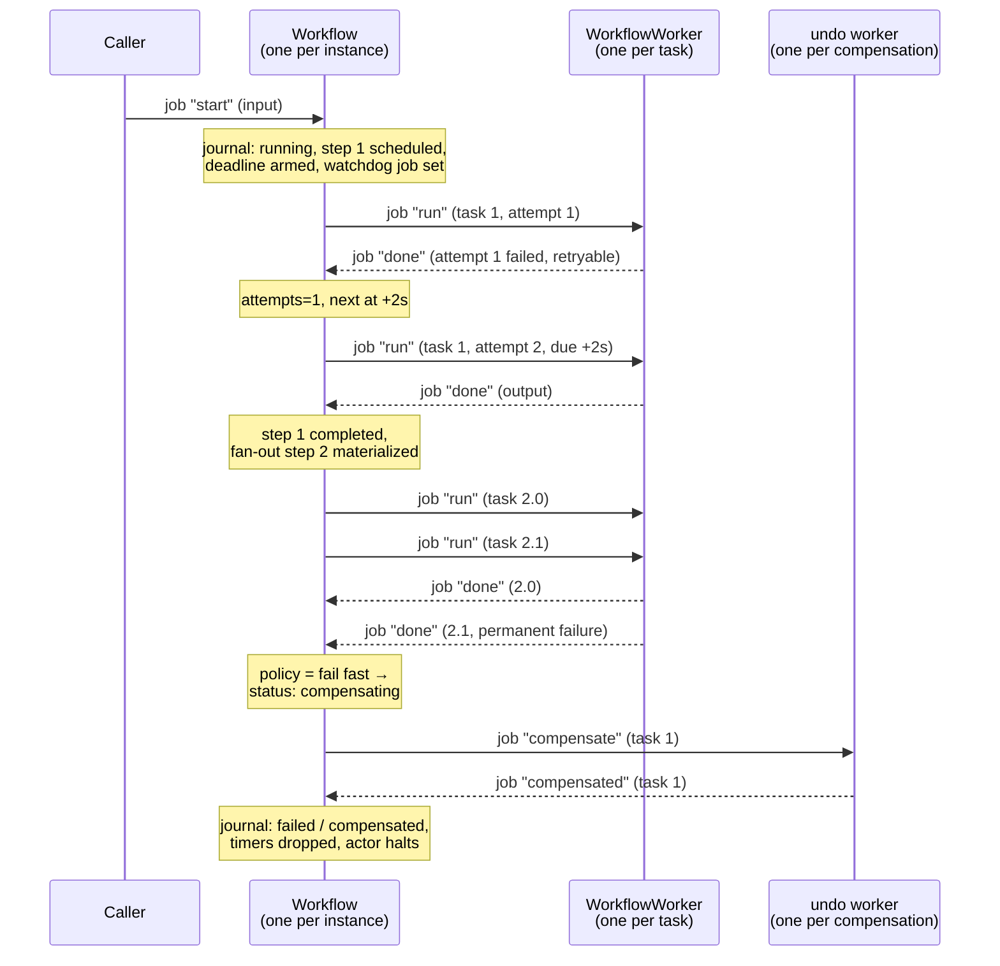
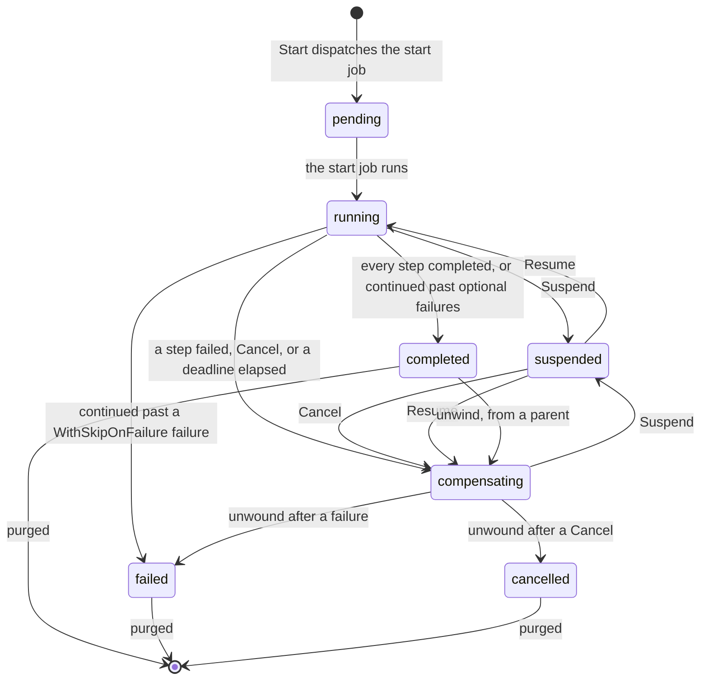

# Design: generic workflows as a built-in actor

- **Status**: draft, revision 3
- **Package**: `builtin/workflow` (new)
- **Reserved actor types**: `francis.builtin.workflow.<name>` (orchestrator), `francis.builtin.workflow.<name>.worker[.<cap>]` (forward tasks), `francis.builtin.workflow.<name>.undo[.<cap>]` (compensations), `francis.builtin.workflow.<name>.registry` (singleton), plus a `cronjob` for auto-purge when enabled
- **Framework changes required**: two small additions to Francis, listed in §16
- **Prior art consulted**: Dapr Workflow and the Durable Task Framework, Temporal, AWS Step Functions, Netflix Conductor (§2.3)

## 1. Summary

Francis already has every primitive a durable workflow engine needs: single-activation actors with turn-based concurrency, durable per-actor state, durable jobs with retries and dead-lettering, named replaceable alarms, and placement that spreads actors across a cluster. What it does not have is the *pattern* that assembles them, so every application that wants "run these steps, in this order, some of them in parallel, and undo them if something fails" writes the same orchestrator by hand.

This document generalizes a pattern first built by hand on top of Francis — an orchestrator actor that fans durable jobs out to worker actors and records what comes back — into a **built-in actor** that runs arbitrary workflows: sequences of steps, parallel groups, dynamic fan-out, child workflows, waits on external events, suspend and resume, and **compensations** that roll back what already succeeded.

Three commitments shape everything below.

The first is that there is **no SDK abstracting the underlying actors**. No code-as-workflow, no replay, no determinism requirement, no hidden control flow. A workflow is a **declared graph of named steps** plus plain Go handler functions, and the engine is a state machine over a durable journal.

The second is the **orchestration boundary** (§4): the `Workflow` actor orchestrates and performs nothing. Every unit of work, without exception, runs on a `WorkflowWorker`. This is the single most important rule in the design, and making it structural — rather than a convention each application has to keep — is most of the value of shipping this as a built-in.

The third is that **the engine owns its own failure handling**. Retry attempts, dead-letter recovery, and the deadline are all recorded in the journal and driven by the same reconcile loop, rather than delegated to per-actor-type settings the engine can't observe. An earlier draft leaned on framework behavior that isn't there; this one doesn't.

## 2. Motivation

### 2.1 The pattern, built by hand

The shape this design generalizes was first built for a service that turns one uploaded image into a set of thumbnails, writes a manifest describing the outcome, and posts that manifest to a callback. Its actors implement the workflow by hand, split into an orchestrator and a worker:

```text
POST /upload
      │  job "start"
      ▼
orchestrator/<id>                               ← state and dispatch, nothing else
      │  job "generate", one per thumbnail
      ├──────────► worker/<id>-0  ┐
      ├──────────► worker/<id>-1  │  read source, encode, write to the store
      └──────────► worker/<id>-2  ┘
      ◄─────────── job "thumbnail-done" ────────┘
      │  job "write-manifest"
      ├──────────► worker/<id>-manifest ──► store manifest.json
      ◄─────────── job "manifest-done" ─────────┘
      │  job "deliver-callback"
      ├──────────► worker/<id>-callback  ──► POST the manifest
      ◄─────────── job "callback-done" ─────────┘
      │
      ▼
  record the outcome → drop the deadline → halt
```

The properties that make it work are all general, and none of them are about images:

1. **The orchestrator performs no step.** It reads and writes its own state, arms its alarm, and dispatches jobs. Every read and write of the object store, every encode, and the callback happen on a worker.
2. **Executable steps are durable jobs; the deadline is an alarm.** A job is dispatched per unit of work, is retried, and is dead-lettered rather than dropped. The deadline is an alarm because it must be replaceable and cancellable by name, and it is re-armed on entry to each step so it covers whichever one is in flight.
3. **There is no phase field.** What the workflow does next is derived from its state — remaining thumbnails, then the manifest, then the callback — which is what keeps every report safe to redeliver.
4. **Every step is idempotent**, because jobs and alarms are delivered at least once: a repeated `start` re-schedules only what has not reported, a repeated result is recorded once, a re-run thumbnail overwrites the same object, and a re-written manifest writes identical bytes.
5. **A duplicate report still drives the next step**, even though it records nothing. A turn that persisted its result and then failed to dispatch is retried from the duplicate branch, and without this the workflow would sit waiting for a step nobody scheduled.
6. **One actor per unit of work** is what buys parallelism: Francis places workers across hosts and bounds them with `WithConcurrencyLimit`.
7. **Failure has two paths**: a retryable error returns and is retried; a permanent one reports a failed result immediately, and the dead-letter hook (`ActorJobFailed`) covers the case where retries are exhausted. The deadline remains the backstop, because that hook is best-effort.
8. **What a step's failure costs the workflow varies by step.** A failed thumbnail is recorded and the workflow still terminates; an unstored manifest fails the workflow and skips the callback; an unacknowledged callback is logged and the workflow still completes.

### 2.2 Why generalize it

Everything above is boilerplate that any durable multi-step process needs, and it is subtle boilerplate: the ordering of "persist, then dispatch", the redrive on a duplicate report, the idempotency keys, the dead-letter hook, the alarm re-armed per step. Getting one of them wrong produces a workflow that stalls forever or double-charges a credit card.

Two things the hand-built version does **not** need, and which a general engine must have:

- **Declared sequencing.** Its order is hard-coded in a `switch` over its own state. That is exactly right for three steps and stops scaling somewhere around five.
- **Compensation.** It writes to an object store, where a partial result is harmless and a manifest records what failed. A workflow that charges a card, reserves stock, and books a courier must be able to unwind.

### 2.3 Prior art consulted

The vocabulary here — steps, compensation, child workflows, external events, suspend and resume — is largely the vocabulary of the existing engines, and the design was checked against them.

**Dapr Workflow, the Durable Task Framework, and Temporal** express a workflow as an imperative function that calls activities, and make it durable by replaying that function from an event history on every resumption. The function must therefore be deterministic: no clocks, no random numbers, no I/O. That is a powerful model, and it is also the source of nearly all of their sharp edges — the determinism rules, the versioning problem when code changes under a running instance, and the size of the SDK needed to hide the machinery. Two things from that family are kept: the orchestrator does no work (which replay enforces by contract, and this design by construction), and activities have their own retry policy. Replay itself is deliberately not adopted.

**AWS Step Functions and Netflix Conductor** are closer to this design's shape — a declared graph of states or tasks, with retries and error handling per state — but they are hosted services driven by a JSON definition and external workers. This design keeps the declared graph and puts the handlers in the same Go process as the actors, with no definition language beyond a Go call.

The cost of a declared graph over replayed code is expressiveness: a graph cannot say "retry the whole subworkflow with a different parameter until it works". The benefit is that the engine is a few hundred lines of state machine with no hidden rules, the journal is directly readable, and a user's handler is just a function that can do whatever it likes — including calling `time.Now()`.

## 3. Goals and non-goals

### Goals

- Sequential steps, static parallel groups, and dynamic fan-out over a runtime-sized list.
- Per-step **compensation callbacks**, run in reverse order when the workflow fails or is cancelled.
- **Child workflows** with their own journal, whose result alone enters the parent's.
- **Suspend and resume** of a running instance, with its deadlines paused.
- Durable and resumable across restarts, host loss, and rebalancing, with at-least-once execution.
- Steps run **anywhere in the cluster**, with per-host concurrency bounds and optional capability requirements.
- **A `Workflow` actor that cannot perform work**, because the engine gives user code nowhere to run on it (§4).
- **Self-healing**: a lost report, a dead-lettered job, or a deleted alarm is recovered by the engine, not by an operator.
- Observable and operable: status query, listing filtered by status, explicit and scheduled purge, metrics, traces, and a journal an operator can read.
- Safe rolling deployments: a definition registry that refuses drift, and instances that drain onto the hosts that can serve them.
- Registered and driven exactly like the other built-in actors (`taskpool`, `cronjob`, `signal`, `ratelimit`).

### Non-goals

- **No code-as-workflow SDK.** There is no `ctx.CallActivity(...).Await()`, no replay of a Go function, and therefore no determinism constraints on user code.
- **No arbitrary control flow.** No `goto`, no unbounded loops, no dynamic graph rewriting. Conditional skipping is supported; anything more expressive belongs in a child workflow or a fresh instance.
- **Not a queue and not a saga coordinator across clusters.** A workflow instance is an actor: it lives in one cluster and one database.
- **No exactly-once.** At-least-once with idempotent handlers, like everything else in Francis.

## 4. The orchestration boundary

> **The `Workflow` actor orchestrates. It never performs a step.**
>
> It reads and writes its own state, arms and drops its timers, and dispatches jobs. Anything that can fail, or that takes longer than an instant, belongs on a `WorkflowWorker`.

This is stated first because it is the rule every other decision in this document defers to, and because it is the rule that is easiest to erode one small exception at a time. "It's only one `PUT`." "The callback usually answers in 50ms." Each is individually defensible and collectively fatal.

### 4.1 Why it matters

A `Workflow` actor holds its turn lock for the duration of a turn. While a turn runs, that instance cannot:

- accept a result from any other worker, so a wide fan-out serializes behind the slow turn;
- accept a cancellation or a suspend, so neither takes effect until the blocking call returns;
- handle its own deadline alarm, so the mechanism that guarantees termination is itself blocked by the thing it exists to bound;
- serve a status `Peek`, because `Peek` excludes an in-flight write turn.

A single blocking call on the orchestrator therefore degrades every property the engine is supposed to provide, and it does so exactly when things are going worst — a store that has become slow, a callback endpoint that has started hanging.

It also breaks the failure model. A step that runs on a worker gets its own attempts, its own backoff, and its own deadline, and a failure is *data* the journal records. The same work inlined on the orchestrator gets the orchestrator's retry policy, and its failure re-runs the whole turn — including the parts that already succeeded.

Francis' other built-ins reach the same conclusion from the same starting point: `cronjob` splits a scheduler from a runner precisely so that a long-running job never blocks the scheduler's lifecycle invocations.

### 4.2 What the rule permits

| On the `Workflow` actor | On a `WorkflowWorker` |
|---|---|
| Decode a report from a job payload | Any call to a database, object store, HTTP API, or queue |
| Mutate the in-memory journal | Any user handler (`WithRun`, `WithCompensate`) |
| `advance`: decide what comes next, as a pure function of the journal | Any CPU-bound work: encoding, rendering, compression |
| Build a job payload from the journal, in memory | Anything with a timeout of its own |
| `GetState` / `SetState` / `DeleteState` | Anything whose failure should be retried independently |
| `SetAlarm` / `DeleteAlarm` | Anything that should appear as its own attempt in the journal |
| `Dispatch` / `CancelJob` / `RetryJob` / `DeleteJob` / `ListJobs` | |
| `Halt`, log, emit a metric | |

The operations in the left column are not free — `SetState` and `Dispatch` are database writes and can fail. The distinction is that they are the framework's own bounded, fast, retried operations, and the whole turn is retried as a unit if one of them fails. The rule is about **external and user work**, which is neither bounded nor the framework's to retry.

Two consequences are worth stating explicitly, because they are the cases that look like exceptions:

- **Deriving a payload is orchestration; writing it is a step.** The thumbnail workflow in §17.1 builds its manifest on the orchestrator, from persisted state, and hands the finished bytes to a worker to store. That is correct on both counts: building is a pure in-memory function of the journal, and doing it there is what makes a retried write store *identical* bytes rather than re-deriving them against a journal that has since moved on.
- **The orchestrator never calls `Invoke` on behalf of user logic.** A synchronous invocation couples this instance's turn lock to another actor's availability and queue depth. Talking to another actor is a step, dispatched as a job, and it reports back like any other. The engine makes exactly one exception for itself: the once-per-host, cached definition-registry check in §14.2, which is framework-owned, bounded to a few milliseconds, and happens at most once per version for the life of the process.

### 4.3 How the engine enforces it

A hand-rolled workflow keeps this rule by discipline. A built-in keeps it by construction, and that is most of the argument for building one:

1. **The definition exposes no hook that runs on the `Workflow` actor.** `WithRun` and `WithCompensate` are the only places user code appears, and both are invoked exclusively by `WorkflowWorker`. There is no `WithBeforeStep`, no orchestrator-side predicate, no expander callback. If a future option seems to want one, that is a signal the feature is a step.
2. **`advance` is a pure function** of `(journal, definition)`. It performs no I/O, takes no `context.Context`, and returns the next journal. It is unit-testable from a serialized journal alone, and it cannot block.
3. **Fan-out sizes come from a step's output** (§8.2), not from a callback the orchestrator runs. This costs one durable round-trip and is the single largest concession the rule extracts — and it is worth it.
4. **Conditions are step outputs** (§7.9), not predicates evaluated on the orchestrator, for the same reason.
5. **Payload and journal size caps** (§12.2) are checked on the worker, before a report is dispatched, so the orchestrator never spends a turn serializing something unbounded.

The engine also asserts the boundary in tests: a `Workflow` actor constructed against a `Service` whose transport panics on anything but state, alarm, and job operations fails any turn that reaches past the boundary.

## 5. Model

### 5.1 Vocabulary

- **Definition** — a named, versioned graph of steps, registered on a host at startup, together with the Go functions that implement them. Registered identically on every host that should run the workflow's steps, and checked against the **registry** (§14) so that it is.
- **Instance** — one execution of a definition, identified by an **instance ID**. One `Workflow` actor instance per workflow instance.
- **Step** — a named node in the definition. A step is one of the kinds below. Step names are unique within a definition.
- **Task** — one execution unit of a step, performed by one `WorkflowWorker` actor and driven by one durable job. A plain step has one task; a parallel group has one per member; a fan-out has one per item; a child step's task is a whole child instance.
- **Attempt** — one run of a task's handler. Attempts are counted in the journal, and the step's retry policy decides how many are allowed.
- **Journal** — the `Workflow` actor's durable state: the instance's status, its input, and one record per step and task. It is the single source of truth.
- **Compensation** — a per-step callback that undoes the effect of a task that completed successfully.
- **Registry** — a cluster-wide singleton per workflow name that records the fingerprint of each version's definition, so two hosts can't serve different graphs under the same version.

### 5.2 Step kinds

| Kind | Constructor | Tasks | Notes |
|---|---|---|---|
| Plain | `workflow.Step(name, opts...)` | 1 | The common case |
| Parallel group | `workflow.Parallel(name, steps...)` | one per member | Members are plain or child steps; they run concurrently |
| Fan-out | `workflow.ForEach(name, opts...)` | one per item, sized at runtime | Items come from an upstream step's output; each task is a plain handler or a child instance |
| Child workflow | `workflow.Child(name, opts...)` | 1 (a child instance) | Runs another registered definition; only its result enters this journal (§11) |
| Wait for event | `workflow.WaitForEvent(name, opts...)` | 0 | Parks the instance until `RaiseEvent` or a deadline |

Steps are addressed **by name**, never by position, which is what makes the journal survive a definition change (§14). `New` rejects a definition with two steps of the same name, and — because a `WaitForEvent` step's event name defaults to its step name and may be set with `WithEventName` — two steps listening for the same event name. Both rules exist so that a report or an event is never ambiguous about which record it belongs to.

### 5.3 Data flow between steps

Each task receives, in its job payload:

- the **workflow input**, as given to `Start`, capped by `WithMaxInputSize` (default 64 KiB);
- the **output of the immediately preceding step**;
- the outputs of any steps named with `WithInputFrom("a", "b")`;
- for a fan-out task, its **item**.

The engine never ships the whole journal to a worker. This keeps the payload bounded and makes the data dependencies of a step explicit and auditable from the definition alone.

A task returns `(any, error)`. The output is JSON-encoded into the journal, subject to `WithMaxOutputSize` (default 16 KiB per task; §12.2 explains the number). What later steps see as a step's output depends on its kind:

| Kind | Output seen by later steps |
|---|---|
| Plain | the handler's return value |
| Parallel group | an object keyed by member name, each member's output as its value |
| Fan-out | an array of the tasks' outputs, ordered by item index; failed items carry `{"error": "…"}` under `TolerateFailures` |
| Child workflow | the child instance's output (§11.3) |
| Wait for event | the event's payload |
| Skipped (§7.9) | absent; `DecodeOutput` returns `ErrStepSkipped` |

Outputs are for **control flow and small results**, not for payloads. The guidance is the same as for actor state: keep large blobs in an object store and put a reference in the output. §12.2 gives the arithmetic that makes this more than advice.

## 6. Public API

### 6.1 Defining and registering

```go
import "github.com/italypaleale/francis/builtin/workflow"

wf, err := workflow.New("order-fulfillment",
    workflow.WithVersion(3),
    workflow.WithTimeout(30*time.Minute),
    workflow.WithRetention(workflow.RetentionPolicy{
        Completed: 24 * time.Hour,
        Failed:    7 * 24 * time.Hour,
        Cancelled: 7 * 24 * time.Hour,
    }),
    // Sweep terminated instances past their retention every night, cluster-wide on one host
    workflow.WithAutoPurge("0 3 * * *"),
    workflow.WithConcurrency(4),
    workflow.WithLogger(log),

    workflow.WithSteps(
        // A plain step, with the compensation that undoes it and its own retry policy
        workflow.Step("charge-card",
            workflow.WithRun(chargeCard),
            workflow.WithCompensate(refundCard),
            workflow.WithMaxAttempts(5),
            workflow.WithRetryBackoff(2*time.Second, time.Minute),
            workflow.WithStepTimeout(30*time.Second),
        ),

        workflow.Step("reserve-stock",
            workflow.WithRun(reserveStock),
            workflow.WithCompensate(releaseStock),
        ),

        // A human (or another system) has to approve before the order ships
        workflow.WaitForEvent("approval",
            workflow.WithEventTimeout(48*time.Hour),
        ),

        // Two independent notifications, run at the same time
        workflow.Parallel("notify",
            workflow.Step("email", workflow.WithRun(sendEmail)),
            workflow.Step("sms", workflow.WithRun(sendSMS)),
        ),

        // One child workflow per element of the "plan-shipments" output, run concurrently
        // Each shipment is a workflow of its own, with its own journal and its own compensations
        workflow.ForEach("ship",
            workflow.WithItemsFrom("plan-shipments"),
            workflow.WithChild(shipmentWorkflow),
            workflow.WithMaxParallel(8),
            workflow.WithFailurePolicy(workflow.CollectFailures),
        ),

        // Best-effort: a failure here is recorded and the workflow still completes
        workflow.Step("notify-analytics",
            workflow.WithRun(postToAnalytics),
            workflow.WithOptional(),
        ),
    ),
)
if err != nil {
    return err
}

// Register before the host starts, on every host that should run this workflow's steps
// The child definition is registered the same way, on the same hosts
err = host.RegisterBuiltInActor(wf)
```

`New` follows the conventions of the other built-ins exactly: a unique name validated with `ref.ValidateComponents`, functional options, a single returned value registered with `RegisterBuiltInActor`, and a `Service` method that binds it to an `actor.Service`. It also validates the graph: unique step and event names, `WithInputFrom` and `WithSkipOnFailure` referring to steps that exist and precede or follow as required, and a child definition that is itself valid.

`WithVersion` is the definition's version and is stamped on every instance it starts. Bump it for any change to the graph (§14.3).

### 6.2 Handler contract

```go
// RunFunc performs one attempt of a task and returns the output recorded in the journal
// It runs on a WorkflowWorker, never on the Workflow actor
// Returning an error records a failed attempt, retried per the step's policy; returning actor.ErrJobPermanentFailure fails the task without further attempts; returning actor.ErrJobRejected declines it so another host runs it, without counting an attempt
type RunFunc func(ctx context.Context, t Task) (output any, err error)

// CompensateFunc undoes the effect of one task that had completed successfully
// It runs on the compensation worker type, and is retried per the step's compensation policy
type CompensateFunc func(ctx context.Context, c Compensation) error

type Task interface {
    // Identity of the task, which is also what every log line and span is tagged with
    InstanceID() string
    Workflow() string
    Step() string
    // Index is the position within a parallel group or fan-out, and -1 for a plain step
    Index() int
    // Attempt is 1 on the first execution and increases with each retry, as recorded in the journal
    Attempt() int

    // DecodeInput reads the workflow input, as given to Start
    DecodeInput(into any) error
    // DecodeItem reads this task's fan-out item, and is a no-op for a step that is not a fan-out
    DecodeItem(into any) error
    // DecodeOutput reads the output of an upstream step, which must be the preceding step or one named with WithInputFrom
    // It returns ErrStepSkipped when that step was skipped
    DecodeOutput(step string, into any) error
}

type Compensation interface {
    Task
    // DecodeResult reads the output this task produced when it succeeded, which is usually what identifies the effect to undo
    DecodeResult(into any) error
    // Cause is the error that caused the workflow to unwind, or the cancellation reason
    Cause() string
}
```

A handler is a plain function. It may call the clock, do I/O, use randomness, and start goroutines — precisely because it never runs on the `Workflow` actor. The only contract is **idempotency**, because at-least-once delivery means it can run twice: once for a retried attempt, and once if the host died between finishing and reporting.

The retry contract is worth being precise about. A returned error does **not** make Francis retry the job. The worker catches it, reports it to the orchestrator as a failed attempt, and halts. The orchestrator records the attempt in the journal and, if the step's `WithMaxAttempts` allows another, schedules the next one after the step's backoff. Attempts are therefore per step, per compensation, visible in `GetStatus`, and independent of any actor-type setting (§7.8).

### 6.3 Driving workflows

```go
svc := wf.Service(host.Service())

// Start an instance
// Without WithInstanceID, the engine mints a UUIDv7, which sorts by creation time
id, created, err := svc.Start(ctx, OrderInput{OrderID: "A-91", Total: 4999})

// Use a natural key to make starting idempotent: a second Start with the same ID finds the first
// created is false, and the input of the second call is discarded, so a caller that must know can check it
id, created, err = svc.Start(ctx, input, workflow.WithInstanceID("order-A-91"))

// Read the current status without taking the Workflow actor's exclusive turn
status, err := svc.GetStatus(ctx, id)

// List instances, filtered server-side by status, paginated in creation order
page, err := svc.List(ctx, &workflow.ListOptions{Status: workflow.StatusRunning, Limit: 50})

// Deliver an external event to a WaitForEvent step
err = svc.RaiseEvent(ctx, id, "approval", ApprovalPayload{By: "ops"})

// Pause a running instance without losing its place, then continue it
err = svc.Suspend(ctx, id, "downstream maintenance")
err = svc.Resume(ctx, id)

// Ask a running instance to stop and unwind
err = svc.Cancel(ctx, id, "customer cancelled the order")

// Drop everything a terminated instance left behind: its journal, its dead-letters, its children
err = svc.Purge(ctx, id)

// Sweep every terminated instance past its retention, which is what the auto-purge cron job runs
n, err := svc.PurgeTerminated(ctx)

// Operator view of the registry: which versions exist, their fingerprints, and any conflicts
defs, err := svc.Definitions(ctx)
```

`Start` returns as soon as the start job is durable: from that point on the work survives a restart of the process. `Start` is idempotent only for suppressing a duplicate dispatch of the *same* request: an instance ID that has already terminated is not restarted (the repeated `start` is dropped), so re-driving a failed run means minting a fresh instance ID.

Authorization — who may `Start`, `Cancel`, `Suspend`, `RaiseEvent`, or `Purge` a given instance — is the calling application's responsibility, as it is for every other actor invocation in Francis. The engine offers no hook for it, deliberately.

## 7. Execution model

### 7.1 The actors

Per registered workflow, the engine registers these reserved types:

| Actor | Actor type | Instances | Responsibility |
|---|---|---|---|
| `Workflow` | `francis.builtin.workflow.<name>` | one per instance, actor ID is the instance ID | **Orchestrator.** Owns the journal. Decides what happens next, records what came back, and terminates. State, timers, and dispatch — nothing else (§4). |
| `WorkflowWorker` | `francis.builtin.workflow.<name>.worker`, plus `.worker.<cap>` per capability | one per task | **Worker.** Performs one attempt of one task and reports the outcome back. Every user `RunFunc` and every external call happens here. |
| Compensation worker | `francis.builtin.workflow.<name>.undo`, plus `.undo.<cap>` per capability | one per compensated task | The same shape as the worker, for `CompensateFunc`. A separate type so compensations have their own per-host capacity budget and can't be starved by forward work. |
| Registry | `francis.builtin.workflow.<name>.registry` | the cluster-wide singleton | Records each version's definition fingerprint; answers the once-per-host consistency check (§14). |

A worker is stateless: the task arrives in its job payload and the result leaves in another job, so it halts itself as soon as it has reported rather than lingering to its idle timeout. This matters for a wide fan-out, which would otherwise hold one activation per task. A worker does keep one thing for the life of its activation: the result of the attempt it just ran, so that if reporting fails and Francis retries the report, the handler is not run again (§7.8).

Splitting orchestrator from worker is what buys parallelism — Francis places workers independently across the cluster — and it is what keeps the orchestration boundary structural rather than aspirational.

### 7.2 The `Workflow` turn

Every turn — whether triggered by the start job, a task report, an event, a cancel, a suspend or resume, the watchdog, or the deadline alarm — runs the same four phases:

```go
func (w *Workflow) turn(ctx context.Context, ev event) error {
    // The journal is the source of truth, and a terminated instance ignores everything but purge
    st, err := w.client.GetState(ctx)
    if err != nil {
        return err
    }
    if st.Status.IsTerminal() {
        return nil
    }

    // Fold the event into the journal
    // A duplicate, or a report for a task the journal already has an outcome for, records nothing here
    // That includes this very turn being retried after its SetState succeeded and its dispatch failed
    apply(&st, ev)

    // Advance the cursor as far as the journal allows, which is a pure function of the journal and the definition
    // This is where a completed step opens the next one, a failed attempt schedules the next, a failed step opens the unwind, and a fully unwound instance terminates
    advance(&st, w.def)

    // The journal is durable before anything is scheduled, so a lost dispatch is always recoverable and an orphan result never is
    // The status label is written in the same operation, so the listing index can never disagree with the journal
    err = w.client.SetState(ctx, st, w.stateOpts(st))
    if err != nil {
        return err
    }

    // Everything the journal says should be running is dispatched, idempotently
    // This runs on every turn, including the ones that recorded nothing, and is a no-op while the instance is suspended
    return w.reconcile(ctx, st)
}
```

`advance` is pure and total: given the journal and the definition, it produces the next journal. It never performs I/O and never runs user code, so it is trivially unit-testable, and a bug in it can be reproduced from a serialized journal alone. `Cursor` (§12.1) is one of its outputs, never one of its inputs.

`reconcile` derives the set of tasks that should be in flight from the journal and dispatches each one with a stable idempotency key. It is the *only* thing that schedules work, and it is safe to run at any time.

**Recovery is not a special code path.** Re-delivering any event, or firing the watchdog, re-runs `advance` + `reconcile` and converges on the same journal.

### 7.3 The three ordering invariants

Everything durable in this design rests on three rules.

**1. Persist before dispatching.** The journal records a task as *scheduled* before the job that runs it exists. If the process dies between the two, the triggering job is retried (jobs complete only after the handler returns), the turn re-runs, and `reconcile` dispatches it. The inverse order would allow a task to report back to a journal that does not know it exists, and that result would be dropped.

**2. A turn that records nothing still schedules.** `advance` and `reconcile` run on every turn, including one whose event was a duplicate. This is not an optimization to skip — it is load-bearing. Consider a turn that persists a result and then fails to dispatch the next step: the job is retried, the report arrives again, and it is now a *duplicate* that records nothing. If the duplicate branch returned early, the instance would wait forever for a step nobody scheduled. The same rule covers the turn's *own* retry: when Francis redelivers the same job occurrence after `SetState` succeeded and `reconcile` failed, `apply` sees an event the journal already reflects. It stays correct only because the guard is "is this outcome already recorded", never "have I seen this delivery before". Phase 1 carries a fault-injection test for exactly this sequence (§19).

**3. The journal decides what happened; the idempotency key only prevents duplicate in-flight work.** Francis maps an idempotency key to the job's name and deduplicates against *live* rows only, so a key is reusable once its job completes **or dead-letters** — dead-lettering moves the row out of the live table. That is exactly right for the first case: the key stops `reconcile` from queueing a second copy of a task that is already pending or running, and the journal's outcome stops a duplicate *report* from being counted twice. The second case is why `reconcile` must never redispatch a task without first asking whether its previous job dead-lettered (§7.8): a freed key would otherwise let a task that could not report be run again on every turn.

### 7.4 Message flow

<!-- label: Sequence · one instance, a retried attempt, a fan-out, a failure and its compensation -->


### 7.5 Job methods

| Method | Target | Dispatched by | Idempotency key |
|---|---|---|---|
| `start` | `Workflow` | `Service.Start`, or a parent instance | `start` |
| `done` | `Workflow` | worker, or a child instance | `done\|<step>\|<index>\|<attempt>` |
| `compensated` | `Workflow` | undo worker, or a child instance | `comp\|<step>\|<index>\|<attempt>` |
| `event` | `Workflow` | `Service.RaiseEvent` | `event\|<name>` |
| `cancel` | `Workflow` | `Service.Cancel`, or a parent instance | `cancel` |
| `unwind` | `Workflow` (a completed child) | a parent instance | `unwind` |
| `suspend` / `resume` | `Workflow` | `Service.Suspend` / `Service.Resume` | `suspend` / `resume` |
| `tick` | `Workflow` | itself, as a repeating job | `watchdog` |
| `run` | `WorkflowWorker` | `Workflow` | `run\|<attempt>` |
| `compensate` | undo worker | `Workflow` | `compensate\|<attempt>` |

Report keys carry the attempt number so that a late report from attempt 1 can never be mistaken for attempt 2's. One report method keyed by step, index, and attempt is enough for every kind of step; the hand-built version needed one method per step.

### 7.6 Worker actor IDs

A worker's ID must be **deterministic**, so that a re-run of `reconcile` addresses the same actor and its idempotency key applies:

```text
<instanceID>|<step>|<index>
```

`|` is the delimiter, so step names are rejected at definition time if they contain it, and instance IDs are rejected at `Start` if they do. (Francis itself only reserves `/`.) A child instance's ID uses the same form, so a child is always locatable from its parent's journal, and the parent's is a prefix of the child's.

A hash of the three components would avoid constraining names at the cost of unreadable actor IDs in logs and traces; readability wins, since these IDs are what an operator greps for.

### 7.7 Timers: one deadline alarm and one watchdog job

The `Workflow` actor keeps two durable timers, chosen for different reasons.

**The `deadline` alarm** is recomputed on every turn to the earliest of the instance timeout, the current step's `WithStepTimeout`, and a `WaitForEvent` step's `WithEventTimeout`. It is an alarm because alarms are **replaceable by name**: `SetAlarm` upserts, so recomputing is one write. The journal records the last-armed `DeadlineAt`, and the turn skips the `SetAlarm` when the newly computed time is unchanged — which is the common case, and which keeps a wide fan-out's reports from each costing a second write on the same row. Re-arming the alarm from inside its own handler is safe because Francis completes alarms by lease, not by name: a replaced alarm is treated as already handled.

**The `watchdog` job** is a repeating job the instance dispatches to itself at `Start` (`WithJobInterval`, keyed `watchdog`, TTL the instance timeout) and cancels at termination. It is a job because a repeating job **survives a failed occurrence** — one that dead-letters is recorded while the recurrence continues — whereas an alarm whose handler fails `MaxAttempts` times is deleted, repeating or not. The watchdog is on by default at a ten-minute interval (`WithWatchdog(0)` disables it; ten thousand running instances cost seventeen ticks a second), and a tick does what no ordinary turn can afford to do on every report:

1. re-run `advance` + `reconcile`, which recovers a lost dispatch;
2. re-arm the `deadline` alarm unconditionally, which restores one that was deleted;
3. scan the workers of every scheduled-not-done task for a dead-lettered job, and the instance's own dead-letters for a lost report (§7.8);
4. re-assert the status label, in case a `SetState` retry raced a purge.

When the deadline fires, the actor determines from the journal which deadline actually elapsed and applies it: fail the outstanding attempts of a timed-out step, or fail the instance on an instance timeout. What a timeout *costs* depends on the step it hit, which the per-step policies in §7.9 decide.

The `Workflow` type itself is registered with `MaxAttempts` of 20 and an initial retry delay of 5 s, far above the framework defaults. Its turns are idempotent, so retrying is always safe, and a generous policy is what keeps a ten-second database blip from dead-lettering a report or deleting a deadline in the first place. The watchdog is the backstop for the cases that still get through.

### 7.8 Attempts, failures, and dead-letters

The engine owns retries. Francis' own retry mechanism is a property of the actor type, not of the job, so it can't express "five attempts for this step, twenty for its compensation"; and a Francis retry is invisible to the journal. So the worker never lets a handler error reach Francis:

1. **Success** — the worker dispatches `done` with the output, and halts.
2. **Retryable failure** — the handler returned an ordinary error. The worker dispatches `done` carrying the error and `retryable: true`, and halts. The orchestrator records the attempt, and if `Attempts < WithMaxAttempts` (default 3) sets `RetryAt` from the step's `WithRetryBackoff` (default 2 s, doubling, capped at 1 min); `reconcile` dispatches the next attempt with `WithJobDueTime(RetryAt)` and a new attempt number in its key. Otherwise the task is failed.
3. **Permanent failure** — the handler returned `actor.ErrJobPermanentFailure`. The worker reports it with `retryable: false`, and the task is failed without further attempts.
4. **Rejection** — the handler returned `actor.ErrJobRejected`. The worker returns it to Francis, which re-routes the occurrence to another host without counting an attempt (the same escape hatch `taskpool` exposes through `WithAccept`).

The distinction between (2) and (3) belongs to the handler: a store that is briefly unavailable recovers, so return the error; a request the encoder rejects, or an identifier that does not parse, fails the same way every time, so return `ErrJobPermanentFailure`.

Each attempt costs a round trip through the orchestrator — one report turn and one dispatch — where a Francis-level retry would have re-run the handler in place. That is the price of attempts being durable, per-step, observable in `GetStatus`, and independent of the actor type's configuration, and it is a price only failing tasks pay.

A worker's `Job` handler returns an error to Francis in exactly one situation: the report dispatch itself failed. Francis retries the job in place; the worker still holds the result of the attempt in memory for the life of the activation, so the retried job re-sends the report rather than re-running the handler. The worker types are registered with a `MaxAttempts` of 5 to cover this case only.

**Dead-letters.** A worker's job dead-letters only when it could not report — five failed report dispatches, or a host that died mid-attempt more than five times. Dead-lettering frees the job's idempotency key, so `reconcile` never redispatches a scheduled-not-done task blindly. Two mechanisms cover this:

- The worker's `JobFailed` hook dispatches `done` with the dead-letter's error and `retryable: true`, so in the common case the orchestrator learns within a turn. The hook is best-effort, so it is the fast path, not the guarantee.
- The watchdog scans. For every scheduled-not-done task it lists the worker's jobs; a dead-lettered `run` or `compensate` is folded into the journal as one failed attempt of transport kind, and then either `RetryJob`'d (which atomically re-dispatches and removes the record) if attempts remain, or `DeleteJob`'d (§16) after the task is failed. It also lists the instance's own jobs, and `RetryJob`s any dead-lettered report or event it finds — the orchestrator's `JobFailed` hook additionally emits a metric and arms the deadline to fire at once, so the scan doesn't wait for the next tick.

The invariant that falls out: **no dead-letter record outlives the journal entry that accounts for it.** By the time an instance terminates, every dead-letter it produced has been retried or deleted, which is what lets `Purge` (§13.3) be a state delete plus a bounded sweep rather than a search.

### 7.9 What a step's failure costs the workflow

Not every step is equally important. The thumbnail workflow in §17.1 has all three cases in one graph: a failed thumbnail is recorded and the run continues, an unstored manifest ends the run as failed and skips the notification, and an unacknowledged notification is logged while the run still completes. A plain step declares what its own failure means with two independent options:

| Declared | After the step fails | Named dependents | Terminal status |
|---|---|---|---|
| (default) | the workflow unwinds (§9) | — | `failed` |
| `WithSkipOnFailure("a", "b")` | the workflow **continues** | recorded as `skipped`, never run | `failed` |
| `WithOptional()` | the workflow continues | — | `completed` |
| both | the workflow continues | recorded as `skipped` | `completed` |

`WithOptional` decides the terminal status; `WithSkipOnFailure` decides which downstream steps are pointless without this one. Neither triggers an unwind — an unwind is only for the default case, where the failure means the work so far must be undone. Skipping is not transitive (a skipped step is not a failed one, so its own `WithSkipOnFailure` list is not applied), a skipped step never enters the compensation stack, and its output is absent (§5.3).

`WithOptional` is the notification case: the work the caller asked for was done, and only a notification was lost. `WithSkipOnFailure` is the manifest case: without the manifest there is nothing to notify about, and the run is a failure, but the thumbnails are in the store and there is nothing to undo.

**Conditional steps** follow from the boundary the same way. There is no `WithCondition(fn)` predicate evaluated on the `Workflow` actor; a condition is a step that returns a boolean, and `WithSkipIf("check", false)` on a following step skips it when that output was `false`. It costs one durable round-trip and is consistent with everything else here: the decision is a recorded output, not a hidden evaluation.

Group and fan-out steps have a richer set of policies, in §8.3.

## 8. Parallelism

### 8.1 Static parallel groups

`workflow.Parallel(name, steps...)` materializes one task per member. The group completes when every member has reported. Members are independent: they receive the same upstream outputs and cannot read each other's.

### 8.2 Dynamic fan-out

`workflow.ForEach(name, workflow.WithItemsFrom("plan"), ...)` materializes one task per element of the named step's output, which must decode to a JSON array. The size is decided at runtime, when the upstream step reports, and is then **journaled**: a retried turn re-reads the recorded items rather than re-deriving them. Each task runs the step's `WithRun` handler, or — with `WithChild` — starts one child instance per item (§11).

Deriving the list is a normal step that runs on a worker. That is a direct consequence of §4: an expander callback invoked on the `Workflow` actor's turn would be simpler to write, but it would put an arbitrary user function on the instance's control plane — the exact thing the boundary exists to prevent. The cost is one extra durable round-trip, and the benefit is that the expansion is itself retried, traced, bounded by a deadline, and recorded like any other step. The list is always a step's *whole* output: a selector for fanning out over one field of the workflow input was considered and rejected, since it would introduce an expression language to save one round-trip, and a small `plan` step is the honest price.

`WithMaxParallel(n)` bounds how many of a fan-out's tasks are in flight **per instance**. The mechanism is a sliding window over the tasks in index order: on every `reconcile`, the first `n` tasks that are not yet done are dispatched, idempotently — a redispatch of a task that is already pending or running coalesces on its key, so no explicit in-flight flag is needed and none is kept. As results arrive, the window slides. The bound is orthogonal to the per-host bound in §8.4, which limits how much work a host accepts across all instances.

### 8.3 Failure policies for groups and fan-outs

| Policy | Behavior |
|---|---|
| `workflow.FailFast` (default) | The first failure fails the step. Tasks already dispatched are cancelled with `CancelJob`; tasks not yet admitted by the window are never dispatched; tasks already running are allowed to finish, and their results are recorded (and compensated, if they succeeded). |
| `workflow.CollectFailures` | Every task runs to completion, then the step fails if any of them failed. Use when the tasks are independent and partial progress is worth having before unwinding. |
| `workflow.TolerateFailures` | Every task runs to completion and the step succeeds regardless. Failures are visible in the step's output, and it is the next step's business what to do about them. |

`TolerateFailures` is the thumbnail case in §17.1: a thumbnail that cannot be encoded is recorded as failed in the manifest and does not stop the run, and the manifest step downstream reads the outcomes and reports them.

`CancelJob` removes a pending job; it does not interrupt an occurrence that is already executing, and Francis does not cancel the handler's context. A task that wants to stop early must observe its context for host shutdown and otherwise finish; the engine treats its late report as a recorded result.

### 8.4 Placement, capacity, and capabilities

Worker and undo types are registered with the same mechanics `taskpool` uses:

- `WithConcurrency(n)` puts every worker type of the workflow into one **capacity group** with a strict, in-process per-host budget, and mirrors it as the cluster-wide `ConcurrencyLimit` placement hint so hosts are rarely handed more than they can run. The undo types form a second group, `WithCompensateConcurrency(n)` (default: the same number), so a slow unwind can't starve forward work or vice versa.
- `WithRequiredCapability(cap)` on a step routes its tasks to `…worker.<cap>`, which only hosts advertising the capability register (`WithCapability(cap)` at `New`). A step with no requirement runs anywhere. A step's compensation is routed to `…undo.<cap>` with the *same* capability, since the undo almost always needs the placement the forward task had — the same GPU, the same region.

This makes "the OCR step only runs on hosts with a GPU" a one-line property of the definition, and it means throughput scales by adding hosts with no change to the definition.

Two operational notes. Every step of a workflow shares one worker type and therefore one per-host budget, so a slow step occupies a slot an expensive one could have used — a callback waiting on a remote server holds a slot sized for an image encode. A per-step capacity group was considered and left out: capability queues already give a step its own budget when it matters, at no extra concept. And `WithMaxParallel` knows nothing about cluster capacity: when in-flight tasks exceed the cluster's total budget, each surplus occurrence is released and re-fetched an alarm poll interval later, so an over-subscribed fan-out degrades to poll-interval pacing rather than failing. `taskpool` has the same property.

## 9. Compensation

### 9.1 Model

Compensation is a **stack**. Every task that completes successfully and whose step declares `WithCompensate` — or whose step is a child workflow — is pushed onto the journal's compensation stack in completion order. When the instance has to unwind, the stack is popped in reverse.

```text
forward:      charge-card ──► reserve-stock ──► ship[0] ship[1] ship[2] ──► ✗ confirm
                                                (parallel children)

unwind:       refund-card ◄── release-stock ◄── unwind ship[0..2]
                                                (parallel, in one frame)
```

Ordering rules:

- **Frames unwind in reverse order.** A step that ran after another is compensated before it, which is the invariant a saga depends on.
- **Within a frame, compensations run concurrently.** The tasks of a parallel group or fan-out had no order between them going forward, so imposing one on the way back would only make unwinding slower.
- **A frame is fully compensated before the next one starts.** This is what makes the reverse order meaningful, and it is why compensation is driven by the same `advance` + `reconcile` loop rather than by dispatching everything at once.

Every compensation is a task on an undo worker, like every other unit of work. The unwind is scheduled by the `Workflow` actor and performed nowhere near it.

### 9.2 What triggers an unwind

- A step fails terminally under the default policy (§7.9), or a group fails under `FailFast` or `CollectFailures` (§8.3).
- `Service.Cancel` is called on a running or suspended instance.
- The instance timeout elapses.
- A `WaitForEvent` step's own timeout elapses without the event.
- A parent instance unwinds a child step (§11.4).

In every case the journal records the **cause**, which is handed to each compensation as `Cause()`. A compensation frequently needs it: "release the stock because the payment failed" and "release the stock because the customer cancelled" may write different audit records.

### 9.3 Executing a compensation

A compensation is a durable job (`compensate`) to the undo worker with the **same actor ID** the forward task used, on the undo type matching the forward task's capability, carrying the same input and item plus the output that task produced. That output is usually what identifies the effect to undo — a charge ID, a reservation token, an object key — which is why `DecodeResult` exists.

Compensations get their own attempt policy, `WithCompensateMaxAttempts` (default 10) and `WithCompensateBackoff`, recorded in the journal exactly like forward attempts (§7.8). The default is higher than the forward policy because a failed rollback leaves the system inconsistent, so it is worth trying harder — and because the engine owns attempts, the higher number costs nothing at the actor-type level.

Compensations are **at-least-once**, like everything else, so `refundCard` must tolerate being called twice for the same charge. In practice this means keying the undo on the forward operation's identifier, which the handler already has.

### 9.4 The failing step itself

By default a step that **failed** is not compensated: the saga convention is that a step which did not complete did not take effect. That is a convention, not a guarantee — a step can fail after its side effect landed and before it reported.

`WithCompensateOnFailure()` opts a step into being compensated even when it failed, for handlers whose effect may be partial. Such a compensation must be written defensively: it may be undoing something that never happened.

### 9.5 When a compensation fails

`WithCompensationFailurePolicy` chooses:

| Policy | Behavior |
|---|---|
| `workflow.ContinueUnwinding` (default) | Record the failure and keep unwinding the remaining frames. The instance terminates as `failed` with `compensation: partial`. |
| `workflow.AbortUnwinding` | Stop at the failed frame. The instance terminates as `failed` with `compensation: failed`, and the journal names exactly which frames were not unwound. |

`ContinueUnwinding` is the default because stopping the unwind at the first problem usually leaves *more* state stranded than continuing does, and because the alternative is an instance that sits in `compensating` waiting for a human. Either way the outcome is explicit in the status, which is what an alert should be built on.

Neither policy silently succeeds: a workflow whose rollback did not complete is never reported as cleanly rolled back.

### 9.6 Status model

Rather than multiplying terminal statuses, the instance carries a status plus a compensation outcome:

```go
type Status string

const (
    StatusPending      Status = "pending"      // the start job is durable but has not run
    StatusRunning      Status = "running"
    StatusSuspended    Status = "suspended"    // paused by Suspend; ResumeTo records what it was
    StatusCompensating Status = "compensating"
    StatusCompleted    Status = "completed"    // terminal
    StatusFailed       Status = "failed"       // terminal
    StatusCancelled    Status = "cancelled"    // terminal
)

type CompensationOutcome string

const (
    CompensationNone      CompensationOutcome = "none"      // nothing needed unwinding
    CompensationCompleted CompensationOutcome = "completed" // every frame unwound
    CompensationPartial   CompensationOutcome = "partial"   // some frames failed, the rest were unwound
    CompensationFailed    CompensationOutcome = "failed"    // the unwind stopped early
)
```

`CompensationOutcome` is empty until the instance reaches a terminal status; while `Status` is `compensating` the per-step view says how far the unwind has got. Per-step status is `pending`, `running`, `completed`, `failed`, `skipped`, `compensating`, `compensated`, or `compensation-failed`.

<!-- label: Instance status · state diagram -->


An instance with nothing on its compensation stack passes through `compensating` in a single turn, so the path is uniform whether or not anything has to be undone.

## 10. Suspend and resume

`Service.Suspend(ctx, id, reason)` pauses an instance without losing its place; `Service.Resume(ctx, id)` continues it. Both are durable jobs to the `Workflow` actor with constant keys, so a repeated call coalesces with a pending one and a call on an instance that is already in the requested state records nothing.

While suspended:

- **Nothing new is started.** `reconcile` dispatches nothing — no next step, no next attempt, no compensation frame. This is the whole of the mechanism: `apply` and `advance` run as usual, so the journal keeps recording the truth, and only the scheduling half of the turn is gated.
- **In-flight work finishes.** A task that was already dispatched runs to completion and its report is recorded. Suspension is a promise not to start things, not an interruption, for the same reason `CancelJob` isn't one (§8.3).
- **Deadlines are paused.** On suspend the `deadline` alarm is deleted and the journal records how much of the instance timeout, the current step's timeout, and any event timeout remained. On resume they are re-armed from those remainders, so a two-day suspension does not eat a thirty-minute timeout. The watchdog keeps ticking and keeps scanning for dead-letters, but dispatches nothing.
- **Events are accepted.** A `RaiseEvent` for the open `WaitForEvent` step is recorded; the step completes on resume.
- **Cancel takes precedence.** `Cancel` on a suspended instance resumes it straight into `compensating`; suspending during an unwind pauses the unwind at the current frame.
- **Children are not affected.** A suspended parent's running children keep running and their results wait in the parent's journal for the resume. Suspend a child explicitly if that isn't wanted; the parent's journal has every child's instance ID.

`GetStatus` reports `suspended`, the reason, when, and what the status was before (`ResumeTo`). The listing index (§13.2) sees the status change like any other.

## 11. Child workflows

### 11.1 Model

A child workflow is a step whose task is a whole instance of another registered definition:

```go
workflow.Child("ship", workflow.WithDefinition(shipmentWorkflow))

// One child per item
workflow.ForEach("ship", workflow.WithItemsFrom("plan-shipments"), workflow.WithChild(shipmentWorkflow))
```

The child has **its own journal**, its own compensation stack, its own timers, and its own attempts. The parent's journal records, per child task, only the child's instance ID and — when it terminates — its output or its failure and compensation outcome. Nothing else crosses: a parent of a hundred children with a thousand steps each is a journal of a hundred small records.

The child definition is registered on the hosts like any other (`RegisterBuiltInActor(shipmentWorkflow)`), and `New` on the parent validates that the child definition it was handed is well-formed. The child's own version is stamped on each child instance independently of the parent's.

### 11.2 Starting a child

`reconcile` starts a child by dispatching `start` to `francis.builtin.workflow.<childName>` with instance ID `<parentID>|<step>|<index>` — deterministic, so a retried turn finds the same child rather than starting a second — and with the task's input (§5.3) as the child's workflow input. The child's journal records its `Parent` (instance ID, workflow, step, index, and depth), and its status label carries `parent=<parentID>` so `List` can find all children of an instance. `WithMaxDepth` (default 8) rejects a `start` whose parent chain is deeper, which is the only way a definition that references itself is stopped.

### 11.3 Reporting back

When a child reaches a terminal status it dispatches `done` to its parent — the same report a worker sends, keyed by the parent's step and index — carrying its output, or its cause and compensation outcome. A child's output is the output of its last step, or of the step named by `WithOutput("step")` on the child's definition.

A child that terminates `failed` or `cancelled` fails the parent's task; the parent's step policy (§7.9, §8.3) decides what that means for the parent. A child's terminal `compensation: partial` is surfaced in the parent's journal even when the parent continues.

### 11.4 Unwinding a child

Compensating a child step means asking the child to undo itself:

- A child that is still running receives `cancel`, unwinds its own stack, and reports `compensated` when it terminates.
- A child that already `completed` receives `unwind`, a verb only a parent may send. It moves the child back to `compensating`, unwinds its stack in reverse exactly as a failure would, and reports `compensated` with its own compensation outcome. A completed child is kept, not purged, for as long as its parent is running for precisely this reason.

A parent's `Cancel` cancels its running children through the same path, and a parent's step timeout cancels the child it was waiting for. A parent's `Suspend` does not propagate (§10).

### 11.5 Lifetime

A child's retention follows its parent's: `Purge` of a parent purges its children first, recursively, then its own dead-letters, then its journal — in that order, so an interrupted purge is safe to repeat. The auto-purge sweep (§13.3) skips instances that have a parent, so a child is never purged from under a parent that might still unwind it.

## 12. Journal

### 12.1 Shape

One state document per instance, as a single actor state value:

```go
type instanceState struct {
    Workflow     string              `json:"workflow"`
    Version      int                 `json:"version"`
    Status       Status              `json:"status"`
    Compensation CompensationOutcome `json:"compensation,omitempty"`
    Input        json.RawMessage     `json:"input,omitempty"`
    Output       json.RawMessage     `json:"output,omitempty"`   // set at completion, from the last step or WithOutput
    Cursor       string              `json:"cursor"`             // derived by advance for display, never read by it
    Steps        []stepRecord        `json:"steps"`              // every step of the definition, recorded at Start
    Stack        []string            `json:"stack,omitempty"`    // compensation frames (step names), oldest first
    Cause        string              `json:"cause,omitempty"`    // what triggered the unwind
    DeadlineAt   time.Time           `json:"deadlineAt,omitzero"` // the last-armed deadline, so an unchanged one is not re-written
    TraceParent  string              `json:"traceParent,omitempty"` // the Start call's trace context, which every span links to
    Suspended    *suspendRecord      `json:"suspended,omitempty"`
    Parent       *parentRef          `json:"parent,omitempty"`
    CreatedAt    time.Time           `json:"createdAt"`
    StartedAt    time.Time           `json:"startedAt"`
    CompletedAt  time.Time           `json:"completedAt,omitzero"`
}

type stepRecord struct {
    Name        string       `json:"name"`
    Kind        Kind         `json:"kind"`
    Status      StepStatus   `json:"status"`     // pending until reached
    Tasks       []taskRecord `json:"tasks,omitempty"`
    Remaining   int          `json:"remaining"`  // tasks that have not reported, so completion is O(1)
    StartedAt   time.Time    `json:"startedAt,omitzero"`
    CompletedAt time.Time    `json:"completedAt,omitzero"`
}

type taskRecord struct {
    Index       int             `json:"index"`
    Item        json.RawMessage `json:"item,omitempty"`    // fan-out item
    ChildID     string          `json:"childId,omitempty"` // child instance, for a child task
    Attempts    int             `json:"attempts"`
    RetryAt     time.Time       `json:"retryAt,omitzero"`  // next attempt is not due before this
    LastError   string          `json:"lastError,omitempty"`
    Output      json.RawMessage `json:"output,omitempty"`
    Error       string          `json:"error,omitempty"`   // set once the task has failed for good
    Done        bool            `json:"done"`
    Compensated bool            `json:"compensated,omitempty"`
    CompletedAt time.Time       `json:"completedAt,omitzero"`
}

type suspendRecord struct {
    At                   time.Time     `json:"at"`
    Reason               string        `json:"reason,omitempty"`
    ResumeTo             Status        `json:"resumeTo"`
    RemainingTimeout     time.Duration `json:"remainingTimeout"`
    RemainingStepTimeout time.Duration `json:"remainingStepTimeout,omitempty"`
}

type parentRef struct {
    InstanceID string `json:"instanceId"`
    Workflow   string `json:"workflow"`
    Step       string `json:"step"`
    Index      int    `json:"index"`
    Depth      int    `json:"depth"`
}
```

`Remaining` is carried explicitly rather than recomputed, which keeps the "have all tasks reported" check from scanning a large fan-out on every result.

`Steps` records **every** step of the definition at `Start`, with the ones not yet reached as `pending`. That costs a few hundred bytes and makes `GetStatus`, the unknown-version path (§14.4), and operator tooling answerable from the journal alone, without the definition on hand.

There is deliberately **no phase field**. `Cursor` is the name of the current step, written by `advance` as a by-product of deriving the real answer from `Steps`; it is never an input to `advance` or `reconcile`, and exists only so that `GetStatus` and log lines don't have to walk the step list. If it ever disagrees with the records, the records win, because nothing reads it.

### 12.2 Size and write amplification

Francis state is read and written as one value per actor, so the journal has to stay small — and every report rewrites the whole document, so it has to stay small *in proportion to how often it is rewritten*. An N-task fan-out writes O(N²) bytes: a journal that grows to 1 MiB over 500 reports has written about 250 MiB through the state store by the time it is done. That, not the cap, is the reason for the guidance below.

- `WithMaxOutputSize` (default 16 KiB) caps a single task's output, enforced **on the worker** before it reports, so the orchestrator never spends a turn serializing something unbounded. Exceeding it fails the attempt permanently with a clear error.
- `WithMaxInputSize` (default 64 KiB) caps the workflow input, enforced at `Start`, because the input is shipped in every task's payload.
- `WithMaxJournalSize` (default 1 MiB) caps the encoded journal, checked before `SetState`. Exceeding it fails the instance, which is a much better outcome than an instance that can no longer persist and therefore can no longer progress.

These compose as one constraint, not three: `tasks × typical output size` should stay well under the journal cap, and comfortably under 256 KiB for anything that reports quickly. A 300-task fan-out gets under 1 KiB per task in practice; the 16 KiB cap is a ceiling against a misbehaving task, not a per-task budget. For wide fan-outs, the pattern is a handle: write the result to the object store and return its key. For fan-outs wider than a few hundred, the pattern is a child workflow per batch (§11), which moves the width into journals that are rewritten independently.

Every write of the journal rewrites the whole document. That is what buys the design its most important property: **a step transition is a single atomic state write**, so there is no partially-applied journal to reason about.

### 12.3 Retention

`WithRetention` takes a policy with one duration per terminal status — `Completed`, `Failed`, `Cancelled` — because a failed run is usually worth keeping longer than a successful one. Retention is enforced in two layers:

- **The purge sweep** (§13.3) is the primary mechanism. It removes the journal, the instance's dead-letters, and its children, and it runs when the operator says so.
- **A state TTL** is the backstop: on termination, the journal is written with a TTL of twice the policy duration, so an instance whose sweep never runs still expires. It is twice the duration so that the sweep always finds the journal it needs to clean up the rest.

Once the state is gone, `GetStatus` reports "not found", and a late report for that instance is dropped. The journal is an operational record, not an audit log. An application that needs a permanent record should write one from a terminal step, which is what the manifest in §17.1 is for.

## 13. Status, listing, and purging

### 13.1 Status

`GetStatus` is a `Peek`, so status reads run concurrently with each other and never queue behind another status read — only behind a write turn, which §4 keeps short. It reads through the provider rather than the activation's cache, so an active actor can't serve a journal past its retention, and if no state exists yet it looks for a live `start` job on the actor, which distinguishes "pending" from "no such instance".

```go
type InstanceStatus struct {
    InstanceID   string
    Workflow     string
    Version      int
    Status       Status
    Compensation CompensationOutcome
    CurrentStep  string
    Steps        []StepStatusView // every step: status, task counts, attempts, timings, error, child IDs
    Cause        string
    Suspended    *SuspendView     // when suspended: since when, why, and what it was
    Parent       *ParentView      // when a child: whose
    CreatedAt, StartedAt, CompletedAt time.Time
}
```

A caller never sees `completed` before every step has reported, including the optional ones.

### 13.2 Listing

`Service.List` is built on `Service.ListStates` with the **state labels** that §16 adds to Francis. The orchestrator writes four labels with every journal write — `status`, `version`, `parent`, and `terminatedAt` (day granularity) — in the same operation as the state, so the index can never disagree with the journal, and `ListStates` filters on them server-side:

```go
page, err := svc.List(ctx, &workflow.ListOptions{
    Status:  workflow.StatusRunning, // or any status; empty means all
    Version: 3,                      // optional
    Parent:  parentID,               // optional: the children of one instance
    Limit:   50,
    After:   page.AfterID(),         // pagination cursor, an instance ID
})
```

Because the default instance ID is a UUIDv7, a listing is in creation order. A label filter is an equality on an indexed column, so "every running instance" is a range scan, not a walk of every retained journal.

### 13.3 Purging

Three levels, from explicit to automatic:

- **`Purge(ctx, id)`** removes one terminated instance: its children first (recursively), then its dead-letters (a bounded set, by §7.8's invariant), then its journal. It refuses a running or suspended instance with `ErrInstanceActive`, and it is idempotent, so an interrupted purge is repeated. `Purge` of an instance with a running parent is refused too; the parent's purge reaches it.
- **`PurgeTerminated(ctx)`** lists terminated instances with `terminatedAt` older than their status's retention and purges each, skipping any with a parent. It returns how many it removed, and it pages, so a backlog of a million terminated instances is a long call rather than a large one.
- **`WithAutoPurge(cron)`** registers a `cronjob` built-in, `workflow.<name>.purge`, whose job calls `PurgeTerminated`. The cron job is a cluster-wide singleton, so the sweep runs on one host per schedule however many hosts registered the workflow, and `RegisterBuiltInActor(wf)` registers it alongside the workflow's own types.

### 13.4 Metrics

Per workflow name: instances started, instances terminated by status, instance duration, step duration by step name and outcome, attempts per task, attempts that were transport failures, dead-letters recovered by the watchdog, compensations run and failed, instances suspended, children started, instances purged, and the current number of running instances.

Two are worth singling out because §4 and §7.3 make them meaningful. A histogram of `Workflow` **turn duration** should sit in single-digit milliseconds, and a regression is the signal that something has been inlined onto the orchestrator that should be a step. And a counter of **turns that re-applied an already-recorded event** — cheap to keep, since Francis stamps every job occurrence with a request ID the turn can log — is the direct measure of how often invariant 2 is doing its job.

### 13.5 Tracing

A workflow instance is a long-lived, multi-host activity, so it cannot be one span, and a Francis job does not carry its dispatcher's trace context — only transport hops propagate it. The engine therefore carries the context itself, in the payloads it controls:

- `Service.Start` records the caller's trace context in the journal as `TraceParent`, and every `start`, `run`, `compensate`, and report payload the engine builds carries the context of the turn or attempt that dispatched it;
- one span per `Workflow` turn and one per attempt, tagged with instance ID, workflow, version, step, index, and attempt, each a child of the span in its payload and **linked** to the instance's `TraceParent`, so a trace can be followed either from the caller's request or from any single turn;
- a child instance's spans link to the parent's `TraceParent` as well as their own.

Carrying context in job payloads generally would be a reasonable Francis feature later; this design does not wait for it.

## 14. The definition registry, versioning, and rolling deployments

A definition lives in Go code on the hosts. A running instance's journal refers to steps by name, in the order the definition had when it started. A deployment that changes the definition while instances are running is therefore the hardest operational problem in this design. Three mechanisms address it.

### 14.1 The registry

`francis.builtin.workflow.<name>.registry` is a cluster-wide singleton — the same shape as `cronjob`'s scheduler — whose state maps each version of the definition to the **fingerprint** of its graph: a hash over the ordered step names, kinds, and the options that change behavior (`WithInputFrom`, `WithSkipOnFailure`, `WithSkipIf`, `WithOptional`, failure policies, the child definition's name and version). Handler *bodies* are not fingerprinted; §14.3 says why that matters.

The registry answers one question, `register(version, fingerprint)`: if the version is unknown, record it and answer `ok`; if it is known with the same fingerprint, `ok`; otherwise `conflict`, with the recorded fingerprint and when it was first seen. It never overwrites, so the first deployment of a version defines it. `Service.Definitions` lists what it holds, and `Service.ForgetVersion(ctx, v)` is the operator's reset for a version that was registered wrongly and has no instances left.

### 14.2 The consistency check

A host cannot learn the answer from `Bootstrap`: Francis drives that hook for singletons and only logs its error. So the check is made where the engine can act on it — **lazily, once per host per version, cached for the life of the process**. The first time this host's `Workflow`, worker, or undo actor handles a job for version `v`, it calls `register(v, fingerprint)` on the registry through the privileged client and caches the answer.

- `ok`: the host serves the version.
- `conflict`: the host **declines every job of that version** with `actor.ErrJobRejected`, so the work re-routes to hosts whose code matches, emits `workflow_definition_conflict` with the version and both fingerprints, and logs at error level (rate-limited). It does not stop the host; other workflows and other versions are unaffected.

This is the one place the orchestrator makes a synchronous call to another actor from a turn (§4.2): a single cached `Invoke`, bounded to milliseconds, at most once per version for the life of the process.

The failure mode is loud by design. If someone changes the graph and forgets to bump the version, the *first* host to deploy registers the new fingerprint under the old number and every host still running the old code starts conflicting — or, if old hosts were first, every new host conflicts and the deploy drains no work at all. Either way the metric fires within one turn, nothing corrupts, and the fix is a version bump (or `ForgetVersion`, if the new graph was the intended one and no old instances remain).

### 14.3 What needs a new version

- **Any change to the graph** — a step added, removed, renamed, reordered, or with a changed policy — changes the fingerprint and needs a new version, or the registry refuses it.
- **A change to a handler's body alone** does not change the fingerprint and needs no new version. That is the direct consequence of not replaying code (§2.3), and its converse should be understood: an instance that has not reached a step yet runs whatever code is deployed for it, so two instances of the "same" version can observe different behavior for the same step depending on when each reaches it relative to a deploy. Treat a materially different handler the way you would any other live code swap — feature-flag it, or bump the version anyway so old instances drain on old code.

### 14.4 Rolling deployments

1. **`WithVersion(n)` is stamped on the journal** when the instance starts.
2. **A host without the instance's version declines to advance it.** The `Workflow` actor's job handler returns `actor.ErrJobRejected`, which halts the actor to clear its placement and re-routes the occurrence to another host — **without counting an attempt and without dead-lettering it**. Old instances drain onto the hosts still running the old code; new instances start on the new one. The same rule applies on the worker and undo types, so a task is never run by a handler set from another version.
3. **The drain is correct but not fast.** A re-route costs a jittered one to two alarm poll intervals. With `k` old-version hosts among `N`, each turn of an old instance expects about `N/k` re-routes before it lands; at a 30 s poll interval, a 20-turn instance on a four-host cluster with one old host takes on the order of an hour to drain. Keep old-version hosts up until `List(Version: old)` is empty, and expect it to take a while.
4. **The deadline alarm has its own branch.** The alarm is delivered to the same actor on the same hosts, so a version-mismatched host cannot simply reject it forever or run `advance` against a definition it doesn't have. When the alarm fires on a mismatched host, the handler works from the journal alone — the full step list is there (§12.1) — and applies `WithUnknownVersionPolicy`: `Park` (default) re-arms the alarm and waits for a matching host; `Fail` terminates the instance as `failed` with cause `unknown version` when the instance timeout has elapsed, without compensation, since no host can run the compensations either. The registry tells the operator which versions are registered, and `List(Version: v)` which instances are parked on one.

## 15. Alternatives considered

**Code-as-workflow with replay.** Rejected per §2.3: the expressiveness is real, but so are the determinism rules, the versioning trap, and the SDK surface required to hide the machinery. The stated goal here is the opposite — that nothing is hidden.

**Let the `Workflow` actor perform "small" steps.** Tempting whenever a step is one fast call, and the shape the hand-built version started from. Rejected per §4: the turn lock makes every blocking call a denial of the instance's own control plane, the work loses its independent attempts, and no boundary drawn at "small" survives contact with a slow day.

**Let Francis retry handler errors.** An earlier draft did, and it is cheaper per attempt — a Francis retry re-runs the handler in place, with the lease held. Rejected because the retry count is a property of the actor type, so a step and its compensation could not have different policies while sharing a type; because Francis retries are invisible to the journal; and because a job that exhausts them dead-letters, which frees its idempotency key and turns the reconcile loop into a re-run loop. Engine-owned attempts cost a report per attempt and buy per-step policy, observability, and a dead-letter that means "could not report" rather than "failed".

**Build the worker on `taskpool`.** Attractive, since `taskpool` already gives strict per-host concurrency, capability queues, and re-routing. Rejected because a task pool is explicitly fire-and-forget and has no result path. The workflow registers its own worker types with the *same* mechanics (`CapacityGroup`, `CapacityGroupLimit`, per-capability types), which is the part worth reusing.

**One actor per step instead of one per task.** Would halve the number of activations for parallel steps. Rejected because a fan-out's tasks would then be serialized by that actor's turn lock, which defeats the purpose.

**An event-sourced journal (append-only records) instead of one document.** Better for large instances and gives a natural audit log. Rejected for now because Francis state is a single value per actor, so an append-only log would need side actors or a second storage concept, and because a single document makes a step transition one atomic write. Child workflows (§11) are the pressure valve: a wide fan-out becomes independent journals. If §12.2's arithmetic turns out to bind in practice, this is the next thing to build.

**A phase field on the journal.** Simpler `advance`. Rejected because it is a second source of truth that can disagree with the records, and because deriving the phase is what makes duplicate reports safe (§7.3, invariant 2). `Cursor` survives only as a derived value nothing reads.

**A secondary index actor for listing by status.** Would need no framework change: shard instances across a few index actors, each holding sets of IDs by status, updated on every status transition. Rejected in favor of state labels (§16) because the index would be a second write on a second actor, updated *after* the journal write and therefore able to lag or dangle, and because "filter a listing by a small label" is useful to every actor application, not only this one.

**An alarm for the watchdog.** One timer instead of two. Rejected because a failing alarm handler deletes the alarm, repeating or not, and the watchdog's job is to survive exactly the conditions that make handlers fail. A repeating job keeps its recurrence through a dead-lettered occurrence, at the cost of being first-write-wins rather than replaceable — which the watchdog, unlike the deadline, never needs.

**Compensations as ordinary steps in a declared "on failure" branch.** More uniform, and it makes the rollback path visible in the graph. Rejected because the unwind set is determined at runtime by how far the instance got, so the branch would have to be conditional on each forward step's status — which is the compensation stack, written less directly.

## 16. Framework changes required

Two additions to Francis, both small and both useful beyond workflows. Everything else in this design is expressible with the API as it stands.

1. **`Service.DeleteJob(ctx, jobID)` for dead-lettered jobs.** The provider interface already has `DeleteDeadJob`; the public `Service` exposes `GetJob`, `ListJobs`, `CancelJob`, and `RetryJob` but no delete, so today a dead-letter record can only leave the store by being retried. The engine needs it to keep §7.8's invariant — no dead-letter outlives the journal entry that accounts for it — and `Purge` needs it to be complete. Any application that dead-letters jobs it decides not to retry needs it too.
2. **State labels, with a filtered listing.** `SetStateOpts` gains `Labels map[string]string` (a handful of short string pairs, written in the same transaction as the state, expiring with it), and `ListStatesOpts` gains `Labels map[string]string`, matched by equality and indexed on `(actor_type, key, value, actor_id)`, so a filtered listing pages in actor-ID order exactly as an unfiltered one does. Three providers — SQLite, Postgres, standalone — and one table each. This is what makes "list the running instances" a range scan instead of a client-side filter over every retained journal.

## 17. Examples

Three workflows, chosen so that between them every feature of the design is exercised by something that would plausibly be built. Each is also a page in the documentation (§18).

### 17.1 Thumbnails and a manifest

An upload becomes a set of thumbnails in several formats and sizes, a manifest describing what was produced, and a notification to the service that asked. A thumbnail that can't be produced is recorded, not fatal; a manifest that can't be stored is fatal, and there is nothing to notify about without it; a notification that can't be delivered is logged, and the run still counts.

```go
thumbnails, err := workflow.New("thumbnails",
    workflow.WithTimeout(10*time.Minute),
    workflow.WithRetention(workflow.RetentionPolicy{Completed: 24 * time.Hour, Failed: 72 * time.Hour}),
    workflow.WithAutoPurge("@hourly"),
    // Encoding is what makes a worker expensive, so this is the number of encoders per host
    workflow.WithConcurrency(runtime.NumCPU()),
    workflow.WithSteps(
        // Normalizes the request into one item per thumbnail to produce
        workflow.Step("plan", workflow.WithRun(planThumbnails)),

        // One task per thumbnail; a thumbnail that cannot be encoded is recorded and does not stop the run
        workflow.ForEach("generate",
            workflow.WithItemsFrom("plan"),
            workflow.WithRun(generateThumbnail),
            workflow.WithMaxAttempts(3),
            workflow.WithFailurePolicy(workflow.TolerateFailures),
        ),

        // The manifest is the durable record of the run; without it there is nothing to notify about
        workflow.Step("manifest",
            workflow.WithRun(writeManifest),
            workflow.WithMaxAttempts(5),
            workflow.WithSkipOnFailure("notify"),
        ),

        // The thumbnails and the manifest are in the store either way, so a lost notification does not fail the run
        workflow.Step("notify",
            workflow.WithRun(deliverNotification),
            workflow.WithMaxAttempts(10),
            workflow.WithRetryBackoff(5*time.Second, 5*time.Minute),
            workflow.WithOptional(),
        ),
    ),
)
```

The handlers are ordinary functions. `generateThumbnail` reads its item, does the work, and returns a small handle — never the bytes:

```go
type thumbnailSpec struct {
    Format string `json:"format"`
    Width  int    `json:"width"`
    Height int    `json:"height"`
}

type thumbnailResult struct {
    Key    string `json:"key"`
    Width  int    `json:"width"`
    Height int    `json:"height"`
    Size   int64  `json:"size"`
}

func generateThumbnail(ctx context.Context, t workflow.Task) (any, error) {
    var in uploadRequest
    err := t.DecodeInput(&in)
    if err != nil {
        return nil, errors.Join(actor.ErrJobPermanentFailure, err)
    }
    var spec thumbnailSpec
    err = t.DecodeItem(&spec)
    if err != nil {
        return nil, errors.Join(actor.ErrJobPermanentFailure, err)
    }

    // A source that cannot be decoded fails the same way on every attempt, so it is reported permanently
    // A store that is briefly unavailable recovers, so that error is returned as-is and retried
    src, err := store.ReadOriginal(ctx, in.SourceKey)
    if errors.Is(err, store.ErrNotFound) {
        return nil, errors.Join(actor.ErrJobPermanentFailure, err)
    } else if err != nil {
        return nil, err
    }
    img, err := encoder.Encode(src, spec)
    if errors.Is(err, encoder.ErrUnsupportedSource) {
        return nil, errors.Join(actor.ErrJobPermanentFailure, err)
    } else if err != nil {
        return nil, err
    }

    // The key is deterministic, so a re-run overwrites the same object rather than leaving a duplicate
    key := thumbnailKey(t.InstanceID(), t.Index(), spec)
    err = store.Write(ctx, key, img.Data, img.ContentType)
    if err != nil {
        return nil, err
    }
    return thumbnailResult{Key: key, Width: img.Width, Height: img.Height, Size: int64(len(img.Data))}, nil
}
```

`writeManifest` reads the fan-out's output — an array of `thumbnailResult` values, with `{"error": …}` in the slots that failed — builds the manifest, and stores it under a key derived from the instance ID, so a retried write stores the same object. `deliverNotification` posts the manifest key to the callback and treats only a 2xx as delivered.

What happens on the ways this goes wrong:

- One thumbnail's format is unsupported. Its attempt reports a permanent failure; `TolerateFailures` records it and the group completes. The manifest lists it with its error, the notification goes out, and the instance is `completed` — `GetStatus` shows the failed task inside a completed step.
- The object store is unreachable for twenty seconds during the fan-out. Every in-flight attempt reports a retryable error; the orchestrator schedules second attempts two seconds out, and third attempts four seconds out if needed. The journal shows `attempts: 2` or `3` on the affected tasks and the run completes a little later.
- The manifest store is down for longer than five attempts cover. The step fails; `WithSkipOnFailure` records `notify` as skipped; the instance terminates `failed`, with no unwind, because there is nothing to undo. `List(Status: failed)` finds it; a new instance with the same input re-drives it once the store is back.
- The callback endpoint returns 503 for an hour. The notification step exhausts its ten attempts over about twenty-five minutes of backoff; `WithOptional` records the failure and the instance is `completed`. The operator sees the failed optional step in status and in the step-failure metric.

### 17.2 Checkout with compensations

A checkout reserves inventory, charges a card, creates a shipment, and confirms. Every step that takes money or holds stock can be undone, and any failure after the charge must refund it. The shipment carrier is a remote service that is sometimes slow.

```go
checkout, err := workflow.New("checkout",
    workflow.WithVersion(2),
    workflow.WithTimeout(15*time.Minute),
    workflow.WithRetention(workflow.RetentionPolicy{Completed: 7 * 24 * time.Hour, Failed: 30 * 24 * time.Hour}),
    workflow.WithSteps(
        // Nothing to undo here: validation has no side effects
        workflow.Step("validate", workflow.WithRun(validateCart)),

        workflow.Step("reserve-inventory",
            workflow.WithRun(reserveInventory),
            workflow.WithCompensate(releaseInventory),
        ),

        // The charge is the step everything else must be able to undo
        // Its compensation is tried harder than anything else in the graph
        workflow.Step("charge",
            workflow.WithRun(chargeCard),
            workflow.WithCompensate(refundCharge),
            workflow.WithMaxAttempts(3),
            workflow.WithStepTimeout(30*time.Second),
            workflow.WithCompensateMaxAttempts(20),
            workflow.WithCompensateBackoff(10*time.Second, 10*time.Minute),
        ),

        // The carrier is slow and flaky; give it room to be, and undo it if a later step fails
        workflow.Step("create-shipment",
            workflow.WithRun(createShipment),
            workflow.WithCompensate(cancelShipment),
            workflow.WithMaxAttempts(6),
            workflow.WithRetryBackoff(5*time.Second, 2*time.Minute),
            workflow.WithStepTimeout(5*time.Minute),
        ),

        // Confirmations are best-effort and independent of each other
        workflow.Parallel("confirm",
            workflow.Step("email", workflow.WithRun(sendConfirmationEmail), workflow.WithOptional()),
            workflow.Step("sms", workflow.WithRun(sendConfirmationSMS), workflow.WithOptional()),
        ),
    ),
)
```

The charge handler is the one to get right. It uses the instance ID and step name as the payment provider's idempotency key, so an attempt that succeeded but could not report — the host died in between — does not charge twice when it runs again; and it returns the charge ID, because that is what the refund needs:

```go
type chargeResult struct {
    ChargeID string `json:"chargeId"`
    Amount   int64  `json:"amount"`
}

func chargeCard(ctx context.Context, t workflow.Task) (any, error) {
    var order orderInput
    err := t.DecodeInput(&order)
    if err != nil {
        return nil, errors.Join(actor.ErrJobPermanentFailure, err)
    }

    // The same key on every attempt means the provider returns the existing charge instead of creating another
    idem := t.InstanceID() + "|" + t.Step()
    ch, err := payments.Charge(ctx, order.PaymentMethod, order.Total, idem)
    if errors.Is(err, payments.ErrDeclined) {
        return nil, errors.Join(actor.ErrJobPermanentFailure, err)
    } else if err != nil {
        return nil, err
    }
    return chargeResult{ChargeID: ch.ID, Amount: ch.Amount}, nil
}

func refundCharge(ctx context.Context, c workflow.Compensation) error {
    var res chargeResult
    err := c.DecodeResult(&res)
    if err != nil {
        return errors.Join(actor.ErrJobPermanentFailure, err)
    }

    // Refunds are keyed on the charge, so a second delivery of this compensation is a no-op at the provider
    // The cause is recorded with the refund because "the carrier failed" and "the customer cancelled" are different ledger entries
    return payments.Refund(ctx, res.ChargeID, c.Cause())
}
```

What happens on the ways this goes wrong:

- The card is declined. `charge` reports a permanent failure on its first attempt; the instance unwinds. The stack holds one frame, `reserve-inventory`, so `releaseInventory` runs, and the instance terminates `failed` with `compensation: completed`. Nothing was charged, so nothing is refunded — the failing step is not on the stack.
- The carrier times out for six minutes. `create-shipment` attempts one through six fail retryable, five seconds, ten, twenty, forty, eighty, and two minutes apart; the sixth failure fails the step. The unwind pops `charge` first — `refundCharge` runs on an undo worker — then `reserve-inventory`. The instance is `failed`, `compensation: completed`, and the customer was refunded before the stock was released, in that order, as the stack guarantees.
- The refund itself keeps failing because the payment provider is down. `refundCharge` is retried up to twenty times over about two hours of backoff. If it never succeeds, `ContinueUnwinding` still releases the inventory and the instance terminates `failed` with `compensation: partial` — the status that a "money may be stranded" alert is built on — with the charge ID in the journal for the operator.
- A host dies after the charge succeeded and before the worker reported. The attempt's job is retried on another host; the handler runs again with the same idempotency key, the provider returns the existing charge, and the report goes out. One charge.
- The customer cancels while the shipment is being created. `Cancel` moves the instance to `compensating`; the shipment attempt in flight is allowed to finish (`CancelJob` does not interrupt it), and if it succeeds its result is recorded and then compensated by `cancelShipment`, along with the refund and the release. The instance is `cancelled`.

### 17.3 Tenant provisioning with approval and child workflows

A new tenant is requested, a manager has to approve it, and then three subsystems are provisioned in parallel — two of them complex enough to be workflows of their own — before the tenant is verified and welcomed. If anything fails after approval, everything provisioned so far is torn down, including whatever the child workflows built.

```go
provisionDatabase, err := workflow.New("provision-database",
    workflow.WithOutput("credentials"),
    workflow.WithSteps(
        workflow.Step("create-cluster",
            workflow.WithRun(createCluster),
            workflow.WithCompensate(deleteCluster),
            workflow.WithStepTimeout(10*time.Minute),
            workflow.WithRequiredCapability("cloud-api"),
        ),
        workflow.Step("create-schema", workflow.WithRun(createSchema)),
        workflow.Step("credentials",
            workflow.WithRun(issueCredentials),
            workflow.WithCompensate(revokeCredentials),
        ),
    ),
)

provisionStorage, err := workflow.New("provision-storage",
    workflow.WithOutput("bucket"),
    workflow.WithSteps(
        workflow.Step("bucket", workflow.WithRun(createBucket), workflow.WithCompensate(deleteBucket)),
        workflow.Step("policy", workflow.WithRun(attachPolicy), workflow.WithCompensate(detachPolicy)),
    ),
)

onboarding, err := workflow.New("tenant-onboarding",
    workflow.WithTimeout(7*24*time.Hour),
    workflow.WithSteps(
        // Opens the review ticket; its compensation closes it with the reason
        workflow.Step("request-review",
            workflow.WithRun(openReviewTicket),
            workflow.WithCompensate(closeReviewTicket),
        ),

        // Parks the instance until a manager approves, or three days pass
        workflow.WaitForEvent("approval",
            workflow.WithEventTimeout(72*time.Hour),
        ),

        // The approval payload says whether it was approved; a rejection is a boolean, not a failure
        workflow.Step("approved", workflow.WithRun(readApproval)),

        // Three subsystems at once, two of them workflows in their own right
        workflow.Parallel("provision",
            workflow.Child("database", workflow.WithDefinition(provisionDatabase)),
            workflow.Child("storage", workflow.WithDefinition(provisionStorage)),
            workflow.Step("dns", workflow.WithRun(createDNS), workflow.WithCompensate(deleteDNS)),
        ),

        workflow.Step("verify",
            workflow.WithRun(verifyTenant),
            workflow.WithInputFrom("provision"),
            workflow.WithSkipIf("approved", false),
        ),

        workflow.Step("welcome", workflow.WithRun(sendWelcome), workflow.WithOptional()),
    ),
)
```

The approval arrives from outside — a button in an admin console, a chat command — as a single call:

```go
err = onboardingSvc.RaiseEvent(ctx, tenantID, "approval", approvalPayload{Approved: true, By: user, Note: note})
```

`verifyTenant` reads the parallel group's output through `WithInputFrom("provision")`: an object with the database child's credentials under `database`, the storage child's bucket under `storage`, and the DNS record under `dns`.

What happens on the ways this goes wrong:

- Nobody approves within three days. The event timeout elapses; the instance unwinds. The stack holds one frame, `request-review`, so `closeReviewTicket` runs with the cause `event timeout`, and the instance terminates `failed`. Nothing was provisioned.
- The manager rejects. `RaiseEvent` carries `Approved: false`; the wait completes, `readApproval` returns `false`, and `WithSkipIf` skips `verify`. The provision group still runs — in this graph a rejected tenant is still provisioned in a sandbox — and the instance completes with `verify` recorded as `skipped`.
- Storage's `policy` step fails permanently after the database child has already completed. The storage child unwinds itself (deletes its bucket) and reports failure to the parent; `FailFast` fails the `provision` group. The parent's stack has two frames: the group — which holds the *completed* database child and the DNS record — and `request-review`. Unwinding the group sends `unwind` to the database child, which pops its own stack (revokes the credentials, deletes the cluster, on the `cloud-api` hosts it ran on), and runs `deleteDNS`, all concurrently; then the ticket is closed. The parent is `failed`, `compensation: completed`; `List(Parent: tenantID)` shows both children in their terminal states.
- The cloud API is under maintenance mid-provisioning. An operator suspends the parent — `Suspend(ctx, tenantID, "cloud maintenance")` — which stops it starting anything new; the children keep running to whatever point their own attempts allow, and their reports wait. The seven-day instance timeout is paused for the duration. `Resume` continues from wherever the journal says the instance is.

## 18. Documentation

Workflows get their own section of the documentation site rather than a page under built-in actors, because the feature has more surface than a page can hold and because its audience — someone deciding whether to model a process as a workflow — arrives with a different question than someone looking up a rate limiter. The built-in actors overview keeps a one-paragraph pointer.

The section is `docs/content/workflows/`, at weight 29, between the built-in actors and the advanced material, with the site's usual front matter (`title`, `nav_title`, `weight`, `description`) on every page:

| Page | What it covers |
|---|---|
| `_index.md` — **Workflows** | What a workflow is here, when to reach for one, the orchestration boundary in two paragraphs, a thirty-line first example, and where to go next |
| `defining.md` — **Defining a workflow** | `workflow.New`, the options, registering on every host, versions, what `New` validates |
| `steps.md` — **Steps and data flow** | Step kinds, what each task receives, outputs by kind, `WithInputFrom`, per-step failure semantics (`WithOptional`, `WithSkipOnFailure`, `WithSkipIf`), retry policy and the retryable/permanent/rejected contract |
| `parallelism.md` — **Parallel steps and fan-out** | `Parallel`, `ForEach`, `WithMaxParallel`, the three failure policies, capabilities and capacity |
| `compensation.md` — **Compensation** | The stack, ordering, writing an idempotent compensation, `DecodeResult` and `Cause`, `WithCompensateOnFailure`, the failure policies |
| `events-and-suspension.md` — **Waiting and pausing** | `WaitForEvent` and `RaiseEvent`, event timeouts, `Suspend` and `Resume` and what they do to deadlines |
| `child-workflows.md` — **Child workflows** | `Child` and `WithChild`, what crosses between journals, unwinding a completed child, depth |
| `running.md` — **Running and observing** | `Start` and idempotency, `GetStatus`, `List` and its filters, `Cancel`, retention, `Purge`, `PurgeTerminated`, `WithAutoPurge` |
| `deploying.md` — **Deploying and versioning** | The registry, what needs a new version, rolling deployments and how long a drain takes, `Definitions`, `ForgetVersion`, `WithUnknownVersionPolicy` |
| `observability.md` — **Metrics and tracing** | Every metric, the two that matter most, how spans link, request IDs |
| `how-it-works.md` — **How it works** | The two actors, the turn, the three invariants, the journal, the timers, attempts and dead-letters — for operators and contributors, and the only page that needs this document's depth |
| `examples/_index.md` — **Examples** | The three examples in §17, one page each: `thumbnails.md`, `checkout.md`, `tenant-onboarding.md`, each with the full definition, every handler, and the failure walk-through |

Each page is written the way the existing built-in actor pages are: the code first, prose that explains why rather than restating what, and no page longer than it needs to be. The examples are the exception — they are complete, so they can be copied.

## 19. Phasing

**Phase 0 — framework.** `Service.DeleteJob` and state labels with a filtered listing (§16), with provider tests in the shared suite. Small, and everything after depends on them.

**Phase 1 — the engine.** `Workflow`, worker, and undo actors; the registry and the consistency check; the journal with the full step list; the `advance`/`reconcile` loop; engine-owned attempts; the deadline alarm and the watchdog job with both dead-letter scans; sequential steps and static parallel groups; per-step failure semantics; `Start`/`GetStatus`/`List`/`Cancel`/`Purge`; retention with the TTL backstop; metrics and tracing. Enough to run the thumbnail example (§17.1) without its fan-out.

**Phase 2 — fan-out and compensation.** `ForEach` with `WithItemsFrom` and `WithMaxParallel`, the three group failure policies, the compensation stack and its policies. The thumbnail and checkout examples (§17.1, §17.2) run end to end, and the documentation section (§18) ships with its first two examples.

**Phase 3 — waiting, pausing, and sweeping.** `WaitForEvent` and `RaiseEvent`, `Suspend` and `Resume` with paused deadlines, per-step capabilities, `PurgeTerminated` and `WithAutoPurge`.

**Phase 4 — composition and deployment.** Child workflows with `unwind`, `WithMaxDepth`, the version drain and its unknown-version branch, `Definitions` and `ForgetVersion`. The tenant-onboarding example (§17.3) runs end to end, and the documentation is complete.

The engine gets the same functional-test treatment as `taskpool` and `signal`, plus table-driven unit tests over `advance` since it is a pure function of a serialized journal. Three tests are named here because they guard the invariants the design rests on: a `Workflow` turn driven against a transport that rejects anything but state, alarm, and job operations (§4); a fault injected between `SetState` and `reconcile` with the retried turn asserted to converge without double-counting (§7.3); and a worker whose report is made to dead-letter, with the instance asserted to recover through the watchdog scan and to leave no dead-letter record behind (§7.8).
