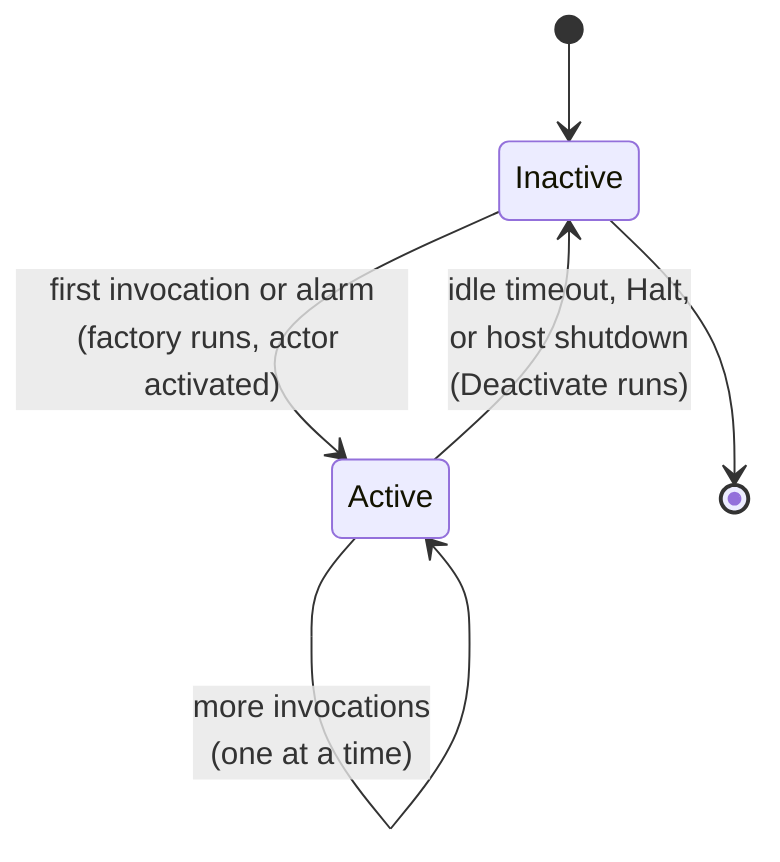

This page explains the building blocks you work with in Francis: actors, hosts, the service, state, alarms, placement, and the actor lifecycle.

> If you're new to the distributed actors pattern, [this article](https://withblue.ink/2025/11/distributed-actors-model) provides a good starting point.

## Actor

Generally speaking, an **actor** is a unit of state with single-threaded compute on top, available to every app in the distributed system.

Within Francis specifically, an actor is an object (a Go struct) that holds in-memory state for the duration of its activation and implements one or more behaviors. An actor is identified by two strings:

- **Actor type**: the kind of actor, e.g. `cart` or `user`. You register a factory for each type with a host.
- **Actor ID**: the specific instance, e.g. `user-42`. IDs are arbitrary strings that you choose.

Together, the type and ID uniquely identify an actor across the whole cluster. At any moment, an actor with a given type and ID is active on **at most one host**, and it processes **one invocation at a time**.

An actor implements behaviors by satisfying optional interfaces:

| Interface | Method | Purpose |
|-----------|--------|---------|
| `actor.ActorInvoke` | `Invoke(ctx, method, data)` | Handle a method call |
| `actor.ActorPeek` | `Peek(ctx, method, data)` | Handle a read-only method call, concurrently with other `Peek`s |
| `actor.ActorAlarm` | `Alarm(ctx, name, data)` | Handle a fired alarm |
| `actor.ActorBootstrapper` | `Bootstrap(ctx, data Envelope)` | One-time setup for a singleton actor when the host becomes ready |
| `actor.ActorDeactivate` | `Deactivate(ctx)` | Run cleanup before deactivation |

An actor implements only the interfaces it needs. See [Writing actors](/docs/writing-actors) for details.  
For the `Bootstrap` hook and cluster-wide singletons, see [Singleton actors](/docs/singleton-actors).

## Factory

You don't construct actors yourself. Instead, you register a **factory** function for each actor type:

```go
func(actorID string, service *actor.Service) actor.Actor
```

Francis calls the factory when it needs to activate an actor of that type. The factory receives the actor's ID and the [service](#service), and returns your actor struct.

## Host

A **host** runs actors. It registers the actor type(s) it can serve, connects to the rest of the cluster, and exposes a peer server so other hosts can forward invocations to actors it owns.

There are two host packages, one per [topology](/docs/topologies):

- `host/local`: an embedded host that carries its own data store
- `host/remote`: a host that connects to a standalone runtime

Both expose the same shape: `NewHost(...)`, `RegisterActor(...)`, `Service()`, and `Run(ctx)`.

Use the local (embedded) host for small (recommended not more than 4), mostly homogenous clusters, where membership does not change frequently.  
Using a standalone runtime allows scaling to support many more hosts, and is best for solutions with many different kinds of hosts (supporting different kinds of actors), and/or auto-scaling dynamically.

## Service

The `actor.Service` is your entry point for interacting with actors. You obtain it from a host with `host.Service()`, and you also receive it in each actor's factory.

Use the service to:

- Invoke actors: `Invoke(ctx, actorType, actorID, method, data)`
- Manage state: `GetState`, `SetState`, `DeleteState`
- Manage alarms: `SetAlarm`, `DeleteAlarm`
- Control actor lifecycle: `Halt`, `HaltAll`

From outside an actor (for example, an HTTP handler), call `service.Invoke(...)` to drive your actors. From inside an actor, it's more convenient to use a [client](#client).

## Client

An `actor.Client[T]` is a typed helper, pre-bound to a single actor, for working with that actor's own state and alarms. `T` is the Go type of the actor's state.

```go
client := actor.NewActorClient[CartState]("cart", actorID, service)

state, _ := client.GetState(ctx)   // typed: CartState
state.Items = append(state.Items, item)
_ = client.SetState(ctx, state, nil)
```

A client caches the state in memory for the lifetime of the activation, so repeated `GetState` calls within one activation don't hit the database every time. Because of each actor's turn-based concurrency model, data is always consistent.

## State

Each actor has its own **durable state**: an arbitrary Go value that Francis serializes to JSON and stores in the database. State is keyed by the actor's type and ID and is independent of the actor's activation. State persists across deactivation, restarts, and moving between hosts.

State can optionally be given a **TTL** so it expires automatically. See [Actor state](/docs/state) for details.

## Alarm

An **alarm** is a durable, scheduled callback. You give it a due time, an optional repeat interval, an optional expiration (TTL), and optional data. When it triggers, Francis activates the actor (if needed) and calls its `Alarm` method.

Alarms are stored in the database, so they survive restarts and are delivered even if the actor was not active at the scheduled time. See [Alarms](/docs/alarms) for details.

## Placement

**Placement** is how Francis decides which host owns a given actor and ensures there is only one activation of it cluster-wide. When you invoke an actor:

1. The receiving host looks up where the actor is placed (or assigns a host if it isn't active yet).
2. If the actor belongs to another host, the call is forwarded to that peer.
3. The owning host activates the actor if needed and runs the invocation.

In the **local** topology, placement is coordinated through each host's embedded data store. In the **remote** topology, instead, the standalone runtime coordinates placement. Either way, callers don't need to know where an actor lives.

## Peek: read-only concurrency

`Invoke` is modeled on an exclusive lock: only one runs at a time for a given actor. `Peek` is the shared analogue, modeled on a read lock: many `Peek` calls against the same actor can run concurrently with each other, while still being mutually exclusive with any in-flight `Invoke`.  
This lets read-heavy workloads avoid waiting behind other reads, without giving up the safety of turn-based concurrency for writes.

An actor opts in by implementing `actor.ActorPeek` alongside (or instead of) `actor.ActorInvoke`. See [Writing actors](/docs/writing-actors#peek-handle-read-only-method-calls) for details, including what the framework can and cannot enforce about read-only behavior.

## Actor lifecycle



- **Activation** happens on the first invocation or alarm for an actor that isn't currently active. Francis calls your factory, then your `Invoke`/`Alarm` method.
- While **active**, the actor stays in memory and handles invocations one at a time (*turn-based concurrency*). State is cached in the client for the activation.
- **Deactivation** happens after a configurable idle timeout, when you explicitly [halt](/docs/writing-actors#halting-an-actor) the actor, or when the host shuts down. If your actor implements `Deactivate`, it runs first so you can flush or clean up.
- After deactivation, the actor's **state remains in the database**. The next invocation re-activates it from scratch (possibly on a different host).

> Note: do not assume that the `Deactivate` callback is always invoked when an actor is being deactivated. In rare cases, such as during crashes of a host or underlying node, actors could be deactivated suddenly and without the `Deactivate` method being invoked.  
> As a consequence, avoid relying on the `Deactivate` method to persist state that you do not want to risk being lost.
