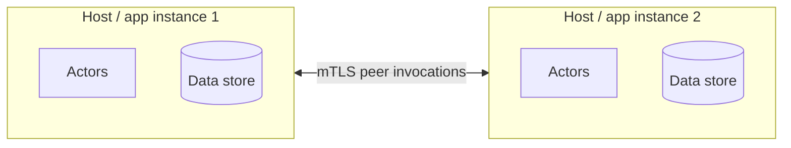
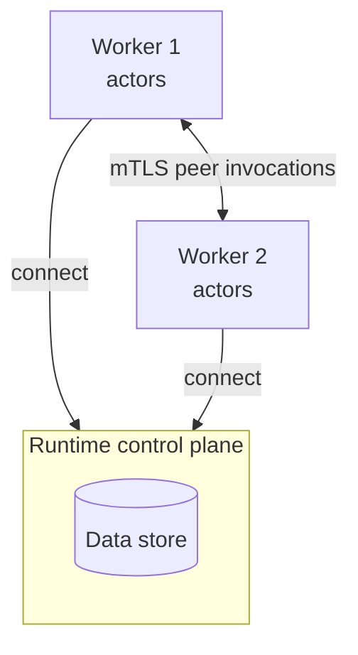

Francis can run in two **topologies**. They differ only in where the data store and coordination live, not in how you write actors. Your actor code (factories, `Invoke`, `Alarm`, state, alarms) is **identical** in both, only the host setup changes.

| | **Local** (`host/local`) | **Remote** (`host/remote`) |
|---|---|---|
| Data store | Embedded in each host | Owned by a standalone runtime |
| Placement / state / alarms | Coordinated through the shared data store, peer-to-peer | Coordinated by the runtime |
| Extra process to run | None | The `runtime` control plane (one or more replicas) |
| Worker process | Self-contained | Stateless, connects to the runtime |
| Typical use | Single-node apps, embedded use, development, small clusters (1-4 instances) | Larger clusters (5+ instances), separation of control plane from workers |

## Local topology

In the **local** topology, everything is embedded in your app. Each host carries its own data store (SQLite or PostgreSQL) and the hosts coordinate **peer-to-peer**: there is no separate control plane process.



You create a local host with `host/local`:

```go
import "github.com/italypaleale/francis/host/local"

h, err := local.NewHost(
	local.WithAddress("127.0.0.1:7571"),
	local.WithSQLiteProvider(local.SQLiteProviderOptions{
		ConnectionString: "data.db",
	}),
	local.WithRuntimePSKs([]byte("change-me-please")),
)
```

Hosts that share the same data store and the same runtime PSK form a cluster: they discover each other, place actors, and forward invocations between themselves over mTLS.

**Choose local when:**

- You want the simplest possible deployment, just your app and a database.
- You're running a single node, or a small cluster that can share a database. While there's no hard limit, best to not exceed 4 replicas, and to avoid auto-scaling them.
- You're developing or testing.

> When several local hosts form a multi-node cluster, they must share a data store that all nodes can reach (typically PostgreSQL). With an embedded SQLite file, a host is effectively single-node — see [providers](#data-store-providers).

## Remote topology

In the **remote** topology, a standalone **runtime** is the control plane. It owns the data store and coordinates placement, state, and alarms. Your workers are stateless actor hosts that connect to the runtime over WebTransport.



The runtime is the `cmd/runtime` binary, configured by a YAML file — see [Deploying the runtime](/docs/deploying-the-runtime). Workers use `host/remote`:

```go
import "github.com/italypaleale/francis/host/remote"

h, err := remote.NewHost(
	remote.WithAddress("127.0.0.1:7571"),
	remote.WithRuntimeAddresses("127.0.0.1:7400"),
	remote.WithHostBootstrapPSK([]byte("host-bootstrap-psk")),
	remote.WithPinnedCA(caPEM), // pin the cluster CA (recommended)
)
```

The worker code is otherwise identical to the local example: you `RegisterActor`, get the `Service()`, and `Run`. Only the host construction differs.

**Choose remote when:**

- You want to separate the control plane (placement, state, alarms) from your stateless workers.
- You're running a larger cluster (5+ replicas) and/or using auto-scaling, and prefer a dedicated coordination tier.
- You want to scale workers independently of where state lives.

Because the runtime persists state to its database, actor state survives both a worker restart and a runtime restart.

## Data store providers

Both topologies persist state and alarms through a **provider**. The available providers are:

| Provider | Local option | Runtime config (`provider.type`) | Notes |
|----------|--------------|-----------------------------------|-------|
| SQLite | `WithSQLiteProvider` | `sqlite` | Best for single-node and development. Must not live on a networked filesystem (NFS/SMB). |
| PostgreSQL | `WithPostgresProvider` | `postgres` | For multi-node clusters that share one database. |
| In-memory | `WithStandaloneMemoryProvider` | `memory` | Non-durable, for tests and single-node ephemeral setups. State is lost on restart. |

The local host also offers standalone provider variants (`WithStandaloneSQLiteProvider`, `WithStandalonePostgresProvider`) that wrap an existing database connection you supply.

> **SQLite vs PostgreSQL for clusters:** a single SQLite file can't be shared safely across machines, so multi-node clusters should use PostgreSQL (or, in the remote topology, let the single runtime own a SQLite file while workers stay stateless).

## Switching topologies

Because actor code is topology-agnostic, moving from local to remote (or back) is a change to **host setup only**: swap `host/local` for `host/remote` (or vice versa) and adjust the construction options. Your factories, `Invoke`, `Alarm`, state, and alarm code don't change.
