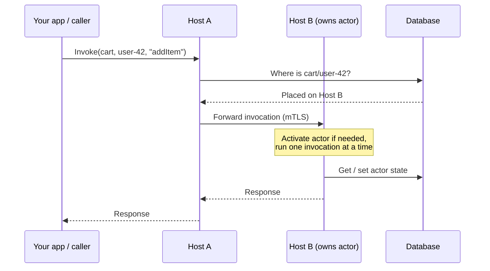

Francis is a framework and runtime for building apps around **distributed actors** (also called _durable objects_) in Go.

An actor is a small, isolated unit of state and behavior that is addressed by a **type** and an **ID**. You write an actor as an ordinary Go struct, then Francis takes care of activating it on a host, routing calls to it, persisting its state, and scheduling its alarms.

Francis is designed to be **simple to adopt** and **low-maintenance**. Its only hard dependency is a relational database (PostgreSQL or SQLite). There is no separate message broker to operate, and — depending on the [topology](/docs/topologies) you choose — there may be no separate control plane service to run either.

## The actor model

Francis implements the **virtual actor** model (the same idea popularized by solutions like Microsoft Orleans, Play Akka, Dapr):

- **Actors always exist, virtually**  
  You never create or destroy an actor explicitly. You just invoke `cart`/`user-42`, and Francis ensures it is activated somewhere in the cluster to handle the call. When it's no longer needed, it's deactivated (or hibernated).
- **Single-activation**  
  At any moment, an actor with a given type and ID is active on at most one host in the cluster. Francis routes every call for that identity to that one activation. You don't shard or pin actors by hand.
- **Single-threaded per actor**  
  An actor processes one invocation at a time. You don't need locks to protect an actor's own state from concurrent access.
- **Durable state**  
  Each actor has its own state, persisted in the database. State is independent of whether the actor is currently active: when an actor is deactivated and later re-activated — possibly on a different host — its state is still there.
- **Location transparency**  
  Callers address an actor by type and ID, never by host. Francis decides placement and routes the request, even if that means forwarding it to a peer host.

This model is a natural fit for entities that have identity and state: a user, a device, a shopping cart, a chat room, a game session, a workflow instance.

## What Francis gives you

- **Invocation**: call an actor by type, ID, and method name, with a request payload and a response.
- **State**: read, write, and delete an actor's durable state, stored in PostgreSQL or SQLite.
- **Alarms**: schedule durable, one-off or repeating callbacks that fire at a future time, surviving restarts.
- **Lifecycle management**: automatic activation on demand, automatic deactivation (hibernation) after an idle timeout, and graceful deactivation hooks.
- **Placement and routing**: single-activation placement across the cluster and transparent forwarding of calls to the host that owns an actor.

## How an invocation flows

A caller can target **any** host. If the host doesn't own the actor, it looks up where the actor is placed and forwards the call to the right peer over an mTLS-secured connection. The result flows back the same way, so callers never need to know which host an actor lives on.

## Two topologies

Francis can run in two [topologies](/docs/topologies), and your actor code is identical in both:

- **Local**: everything is embedded in your app. Each host carries its own data store, and hosts coordinate peer-to-peer. There is no separate control plane process to run.  
  This is ideal for smaller cluster of 2-5 hosts at most.
- **Remote**: a standalone **runtime** owns the data store and coordinates placement, state, and alarms. Your workers are stateless hosts that connect to it.  
  This allow scaling to a larger and variable number of hosts.

See [Topologies](/docs/topologies) to choose the right one for your deployment.

## What you need

- **Go** to build your app (Francis is a Go library).
- A **database**: SQLite for single-node or development setups, PostgreSQL for multi-node production deployments.

That's it. There is no required message broker, cache, or external coordination service.

## Where to go next

- Read the [core concepts](/docs/concepts) to understand actors, state, alarms, and placement in depth.
- Follow the [Quickstart](/docs/quickstart) to run a small cluster locally.
- Learn how to [write actors](/docs/writing-actors).
